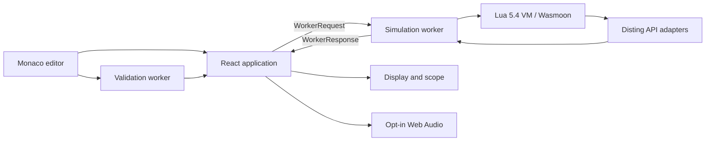

# Luading architecture

This document describes the architecture of Luading - Disting NT Lua Simulator,
the boundaries between its browser processes, and the rules for extending it.

The project prioritizes fidelity to the Disting NT Lua 1.12 contract. The
simulator is not a cycle-accurate hardware emulator: browser timing, Web Audio,
and mocked physical interfaces are explicitly separated from hardware contract
behavior.

## System overview

Luading is a static React and TypeScript application built with Vite. It runs
entirely in the browser and requires no application server or database.

There are four relevant execution contexts:

1. The browser main thread renders React controls, the simulated display, scope,
   diagnostics, and runtime telemetry.
2. The simulation Web Worker owns the Lua VM and real-time simulation state.
3. The validation Web Worker performs source analysis without blocking editing
   or simulation.
4. Monaco uses its own editor worker for language-editor services.

No React component directly owns Lua state. Communication with the simulation
worker uses the typed messages in `src/disting/types.ts`.

## Application shell

`src/main.tsx` mounts `src/App.tsx`, which renders `DistingPlayground`.
`DistingPlayground.tsx` is the main-thread coordinator. It:

- owns editor source and presentation state;
- creates, replaces, and terminates workers;
- sends typed user actions to the simulation worker;
- rejects stale validation-worker responses;
- batches trace data into the scope and audio router;
- acknowledges simulator frames only after the matching React commit; and
- pauses simulation when the page is hidden.

The application is served at `/`. Vercel permanently redirects the former
`/disting` route to `/`.

## Simulation worker

`src/disting/disting.worker.ts` is the runtime orchestrator. It owns:

- Lua VM creation and disposal;
- the 1 ms control-step scheduler;
- the 30 fps draw scheduler;
- 20 fps main-thread frame delivery;
- input-edge detection;
- output state and trace batching;
- callback timing and runtime diagnostics;
- front-panel and MIDI event dispatch; and
- preset-state serialization.

Only one simulator frame may be awaiting a main-thread commit at a time. The
worker sets its frame-in-flight flag before posting a frame, and
`DistingPlayground` returns `frameAck` after React commits that revision. This
backpressure prevents non-urgent renders from being superseded indefinitely and
discards acknowledgements associated with a replaced worker.

The worker must remain an orchestrator. Reusable behavior belongs in
`src/disting/emulation/` so it can be tested independently.

### Script load sequence

When the UI sends a `load` request, the worker:

1. pauses and disposes the previous runtime;
2. resets clock, display, preset, telemetry, and signal state;
3. creates an isolated Wasmoon engine;
4. registers Disting constants and global API adapters;
5. registers bundled Lua modules through `package.preload`;
6. executes the script and installs its reusable callback thread and timeout
   hook through `emulation/lua-runtime.ts`;
7. restores `self.state` before calling `init`;
8. validates the raw `init` result;
9. normalizes metadata through `emulation/lua-contract.ts`;
10. initializes parameters, buses, signals, UI state, and display; and
11. returns the loaded program and diagnostics to the main thread.

The production Lua runtime bridge is also used by integration and bundled-script
tests. Test-only Lua wrappers must not diverge from this path.

### Control-step data flow

Each simulated 1 ms step follows this order:

1. Sample all configured signal sources.
2. Detect typed input edges.
3. Call `trigger()` on trigger rising edges.
4. Call `gate()` on both gate edges.
5. Apply sparse output updates returned by edge callbacks.
6. Call `step(dt, inputs)`.
7. Apply sparse `step` output updates.
8. Advance simulation time and the shared musical clock.
9. Add an immutable input/output snapshot to the pending trace.

Lua bus indices are 1-based. TypeScript arrays are 0-based, and conversion must
remain confined to boundary helpers. Missing entries in a callback output table
retain their previous voltages.

## Emulation modules

The core emulator is split by hardware-facing responsibility:

- `lua-runtime.ts` loads chunks, binds lifecycle methods to `self`, registers
  Lua modules, and invokes callbacks through one runtime-owned Lua thread with
  one reusable instruction-timeout hook. The 1 kHz step boundary passes inputs
  as scalar arguments and reconstructs the Lua input table in the VM, avoiding
  per-callback Wasm function and table-bridge allocation.
- `lua-contract.ts` maps Lua `init` tables, constants, buses, names, parameters,
  output modes, and MIDI metadata into typed host data.
- `runtime-helpers.ts` applies callback output tables, detects trigger/gate
  edges, filters MIDI, normalizes serialized state, and maps runtime errors.
- `display-api.ts` implements Disting drawing globals and emits
  renderer-independent draw commands.
- `display-font.ts` measures and rasterizes text from firmware-derived Selawik
  and pixelmix atlases without using browser fonts.
- `display-bounds.ts` detects text whose actual rasterized glyph bounds extend
  outside the hardware framebuffer.
- `display-renderer.ts` rasterizes commands onto the 256x64 canvas and
  quantizes atlas coverage to the display's 16-shade black-to-`#02F1EF`
  palette.
- `signal-sources.ts` implements deterministic CV, gate, trigger, sequencer,
  noise, and shared-clock sources.
- `preset-api.ts` provides deterministic companion algorithms for preset and
  parameter APIs.
- `hardware-api.ts` clamps and records MIDI/I2C operations. It never accesses
  physical hardware.
- `scope-model.ts` selects triggers and trace windows independently of React.
- `audio-routing.ts` turns dense output traces into musical events.
- `web-audio.ts` owns the opt-in browser audio graph and synthesized voices.

Web Audio is a monitoring convenience. It is not part of the Disting hardware
contract and never feeds values back into the simulation.

## Display and front panel

Lua drawing calls are legal only while `draw()` is active. The display adapter
supports integer and smooth primitives, 16 shades, standard and tiny text,
alignment, and the standard parameter line. Standard and tiny text use
pre-rasterized atlases generated from the Selawik and pixelmix fonts embedded in
the 1.12 firmware, so glyphs and metrics do not vary by browser or operating
system.
Both faces place each glyph from the bitmap-top metric relative to the baseline
supplied by the script.

If `draw()` returns true, the default parameter line is suppressed. An explicit
`drawStandardParameterLine()` call still requests it.

Custom algorithm UI is enabled when `ui()` returns true. Pot, encoder, and button
events then dispatch to script callbacks. Without custom UI, pot events use the
standard parameter-selection and value behavior.

## Validation architecture

Validation deliberately has three layers:

1. Static validation inspects source without executing it. It finds API misuse,
   real-time hazards, drawing outside `draw`, read-only parameter writes, and
   clarity issues.
2. Contract validation inspects the raw program and `init` result. It validates
   callbacks, buses, names, parameter forms, and MIDI filters before metadata is
   normalized.
3. Runtime validation observes actual callback results, invalid voltages,
   undeclared outputs, drawing context, Lua errors, and browser-local timing.

`validation/api-manifest.ts` is the canonical catalog for firmware-facing global
functions. IntelliSense and compatibility validation consume the same catalog.

`validation/score.ts` is the only module that converts findings into the
100-point quality score. Compatibility notes and browser-local timing must not
be misrepresented as hardware contract failures.

## Editor architecture

`editor/DistingCodeEditor.tsx` owns Monaco's text model. Source text is not
mirrored through React on every keystroke, preventing editor activity from
rerendering the display, scope, and runtime controls.

`editor/disting-intellisense.ts` provides Lua and Disting completions, hovers,
signatures, and lifecycle snippets. It consumes API metadata but does not
communicate with the simulation worker.

## Testing boundaries

The tests mirror the production boundaries:

- manual conformance tests pin the public Disting NT Lua 1.12 contract;
- emulator unit tests cover pure boundary behavior;
- Wasmoon integration tests execute the production Lua runtime bridge;
- corpus tests load and exercise every bundled Lua script; and
- coverage thresholds guard the selected simulator core.

See `docs/TESTING.md` for commands, thresholds, and the detailed test matrix.

## Build and deployment

Vite produces a static `dist/` directory containing the application, workers,
Lua WASM runtime, Monaco chunks, and assets. `vercel.json` defines:

- `npm ci` as the reproducible install command;
- `npm run build` as the production build;
- `dist` as the output directory; and
- permanent legacy-route redirects.

The GitHub Actions workflow runs `npm run check` on pull requests and pushes to
`main`. Vercel is connected separately for static production deployment.

## Extension rules

### Adding a Disting global API

1. Add the public signature to `validation/api-manifest.ts`.
2. Implement behavior in an `emulation/` adapter.
3. Register the adapter in the simulation worker.
4. Add focused unit and Lua-boundary tests.
5. Update manual conformance coverage when the public contract changes.

### Adding lifecycle or worker behavior

1. Add typed request or response fields to `types.ts`.
2. Keep scheduling and dispatch in the worker.
3. Extract reusable state transitions into `emulation/`.
4. Add regression tests before connecting React controls.

### Adding a signal source

1. Extend the `SignalShape` type.
2. Add it to the visible source catalog.
3. Implement the exhaustive `signalValueAt` branch.
4. Test normalization, phase behavior, and deterministic output.

### Adding validation

Every finding needs:

- a stable rule ID;
- an origin of static, contract, or runtime;
- a target of hardware, simulator, or local;
- a severity appropriate to the certainty of the finding; and
- a bounded score penalty when applicable.

Static heuristics should not become contract errors unless runtime or raw
contract evidence proves the violation.

## Related documentation

- `docs/TESTING.md` - test layers, commands, and coverage policy
- `src/disting/ARCHITECTURE.md` - lower-level emulator implementation notes
- `docs/Disting NT Lua Scripting 1.12.pdf` - current firmware-facing contract
