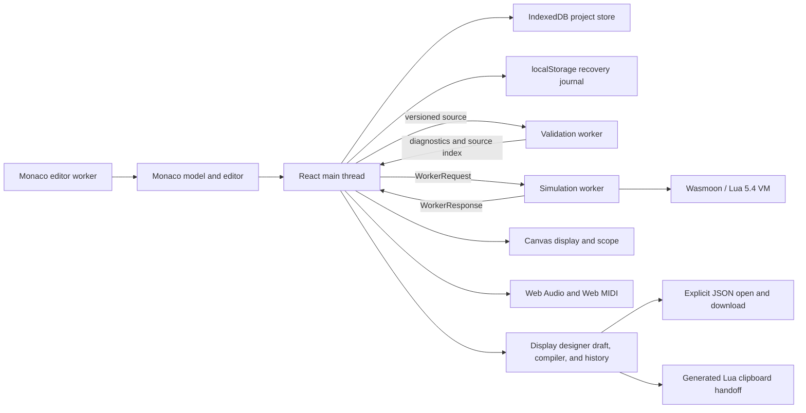

# Luading architecture

This is the canonical architecture document for Luading, the browser-based
Disting NT Lua workbench. It describes current ownership, boundaries, flows,
and invariants. Detailed test guarantees live in [TESTING.md](TESTING.md), and
user-facing behavior lives in [WORKBENCH_GUIDE.md](WORKBENCH_GUIDE.md).

## Purpose, scope, and non-goals

Luading is a static React and TypeScript application built with Vite. It runs at
`/`, entirely in the browser, without an application server or database. The
legacy `/disting` path is only a compatibility redirect.

The project prioritizes behavioral fidelity to the documented Disting NT Lua
contract. It provides an isolated Lua runtime, script validation, deterministic
browser-side signal sources, a simulated display and front panel, and optional
Web Audio and Web MIDI routing.

Luading is not:

- a cycle-accurate emulator of Disting NT hardware;
- a calibrated predictor of Disting NT CPU usage or callback timing;
- a model of every algorithm and bus in a complete hardware preset; or
- a reason to change documented Lua behavior for browser convenience.

Browser timing, browser device routing, and simulator-only input generators are
useful workbench features, but they are not firmware behavior.

## Sources of truth

Use the evidence hierarchy in [the documentation map](README.md):

1. Reproducible behavior observed on real Disting NT hardware.
2. The official [Disting NT Lua Scripting 1.12 PDF](Disting%20NT%20Lua%20Scripting%201.12.pdf).
3. Official scripts as compatibility evidence, not automatic contract evidence.
4. The simulator implementation, tests, and machine-readable support metadata.
5. Browser-only extensions, explicitly labelled as simulator conveniences.

The [Markdown manual](Disting%20NT%20Lua%20Scripting.md) is a searchable
extraction of the PDF and may contain conversion errors. Hardware observations
must record the firmware version and reproduction steps before they override a
manual-backed expectation.

`src/disting/validation/api-manifest.ts` is the canonical machine-readable
catalog for the simulator's Disting APIs, constants, callbacks, provenance, and
support levels. It keeps runtime registration, validation, conformance tests,
and editor assistance aligned. It describes the simulator; it is not a higher
hardware authority than the PDF or verified hardware behavior.

## Execution topology

| Context | Owns and may access | Must not own |
| --- | --- | --- |
| React/main thread | DOM, React, Monaco integration, browser storage, file import/export, canvas rendering, Web Audio, Web MIDI permissions and device identities | Lua VM state or the 1 ms control loop |
| Simulation worker | Wasmoon engine, Lua program and callbacks, simulated clock, inputs, outputs, parameters, draw commands, telemetry, runtime diagnostics | DOM, React, browser storage, Web Audio, or physical MIDI port IDs |
| Validation worker | A persistent Wasmoon compiler, syntax/static analysis, and compact source-index construction | Executed user chunks, simulation state, or UI state |
| Monaco editor worker | Monaco's editor-service support | Disting simulation, validation policy, or hardware adapters |

Disting-specific completion, hover, navigation, and diagnostic adapters are
registered with Monaco on the main thread. Their source/context helpers are
pure and do not communicate with the simulation worker.

## State ownership

| State | Authoritative owner | Mirroring and persistence |
| --- | --- | --- |
| Editor text | Monaco model while mounted; textarea fallback otherwise | `DistingPlayground` mirrors the source and monotonically increasing version for validation/loading; `useProjectLibrary` mirrors user-owned source into IndexedDB after debounce and protects a pending active edit with a compact `localStorage` journal |
| Local script projects and active document | Main-thread project-library coordinator | IndexedDB is authoritative across sessions; validated in-memory copies drive React, while bundled templates remain immutable and are referenced by stable IDs |
| Lua VM, `self`, callbacks, and loaded modules | Simulation worker | Replaced as a unit whenever a script is loaded |
| Simulated clock and control-step position | Simulation worker | Clock configuration is mirrored in the main-thread controls |
| Generator configuration and external input values | Simulation worker signal bank | Main thread owns the selected generator/Web MIDI route; physical port mappings remain main-thread-only |
| Output voltages and pending traces | Simulation worker | Frames mirror current values; `TraceHistory` owns bounded main-thread history outside normal React state |
| Script parameters | Worker `LuaScriptParameterModel` and the Lua program table | Current values are mirrored to React for presentation and control input |
| Script-declared parameter presets | Simulation worker after raw Luading-extension validation | Normalized names/values are sent in `LoadedProgram`; the main thread derives the active/Custom label from mirrored parameter values |
| Draw commands | Worker `DistingDisplayApi` | Main thread rasterizes the command list to the 256x64 display |
| Web Audio and Web MIDI routing | Main thread | Never serialized into the Lua contract; browser port identities never enter the worker |
| Saved `self.state` | Produced by the worker, held by the coordinator | Kept in memory for a subsequent load; not browser-persisted |
| Layout, density, responsive mode, theme, and editor text size | Main thread | Best-effort `localStorage`; storage failures fall back to defaults |
| Open display design, document-owned layout-grid definition, selection, preview values, and undo history | Main-thread `DisplayDesignerDialog` | Document edits are retained for the mounted workbench session unless explicitly downloaded as `.luading-display.json`; never mirrored to a worker, project record, recovery journal, or Lua state |
| Display-designer layout-grid visibility, pixel-grid visibility, pixel preview, geometry overlay, and snap preference | Main-thread `DisplayDesignerDialog` view state | Retained only for the mounted workbench session, including across opened designs; excluded from document history, dirty state, downloads, generated Lua, and worker protocols |
| Syntax/static diagnostics and source index | Validation worker result | Accepted only for the current source version |
| Contract diagnostics | Simulation worker during load | Cleared on source changes and replaced by the next load result |
| Runtime diagnostics and console events | Simulation worker, accumulated by the coordinator | Bounded or deduplicated for display; never treated as source-version-independent proof |

`DistingPlayground.tsx` is the main-thread coordinator. It creates and replaces
workers, mirrors editor source, routes typed actions, rejects stale responses,
owns browser adapters, and composes presentation state. React components below
it receive typed values and callbacks; they do not reach into worker state.

## Dependency direction

The intended dependency direction is:

1. Presentation components consume typed values, view models, and callbacks.
2. The coordinator and workers translate events into typed protocol messages.
3. Worker orchestration delegates reusable behavior to `emulation/` and
   `validation/` modules.
4. Emulator and validation modules do not import React or presentation code.
5. Monaco adapters depend on pure source-index and cursor-context helpers.

Browser device identities and permissions stop at the main-thread boundary.
Only voltage/pulse batches, firmware-facing MIDI bytes, configuration, and
typed control events cross into the simulation worker.

Project IDs, source, modules, editor view, active-document metadata, recovery
journals, backup files, and browser storage capability results also remain on
the main thread. None are members of the Lua contract or fields in the
simulation-worker protocol.

Most `emulation/` modules are reusable hardware-facing or browser-independent
models. `web-audio.ts` and `web-midi.ts` are current exceptions: they are browser
adapters located in that directory but instantiated only on the main thread.
Separating browser adapters from pure emulation is a recorded pressure point,
not an excuse to import browser APIs into the worker.

## Runtime flows

### Local project hydration and autosave

Startup opens schema version 1 of the `luading-workbench` IndexedDB database and
validates every project before creating either the validation or simulation
worker. Malformed records are quarantined from the visible library. The
coordinator then compares the compact active-source recovery journal with the
stored revision, creates a separate recovery project when the journal is newer,
and resolves the active document from stored metadata, recent projects, or the
default template. Only that resolved source is sent to the workers.

Monaco remains authoritative while mounted. A source edit updates the
in-memory project immediately, writes the synchronous recovery journal, and
queues a 400 ms IndexedDB transaction. A successful transaction compares the
loaded revision, advances it exactly once, and only then presents **Saved
locally** and removes the matching journal. Cursor and scroll metadata use a
longer queue and do not advance the source revision. Run and document
replacement flush pending source work first; visibility loss, `pagehide`, and
unmount also request a flush, while retaining the journal because asynchronous
completion during page teardown is not guaranteed.

Bundled scripts are template documents. Their first edit creates a user-owned
project with a defensive module snapshot; selecting the same bundle again
loads its pristine source. New and ordinary `.lua` Import create independent
projects. Soft deletion retains the record for Undo, while ordinary library
queries and version-one backups omit deleted projects.

IndexedDB writes use transactional optimistic concurrency. If another tab has
already advanced a project revision, the stale source is committed as a new
conflict-copy project in the same transaction rather than overwriting the
newer source. `BroadcastChannel`, when available, provides early notification
but is not the correctness boundary. If IndexedDB fails, an explicit in-memory
store keeps the workbench usable and the journal protects only the active
source when possible; the UI does not label that state as saved locally.

### Display-design authoring and file handoff

The display designer is an independent main-thread authoring flow. Its React
dialog owns the normalized design document, semantic undo history, selection,
pointer gesture preview, responsive panel state, preview binding values, and
downloaded-revision marker. Version 3 added ordered document-wide numeric tokens
and bounded token-expression ASTs; version 4 adds bounded pixel-box shade arrays
to that main-thread document. The singleton uniform layout-grid definition is
document-owned; grid visibility and pointer-snapping preferences remain view
state. Pure modules below the dialog parse and print the closed arithmetic
grammar, validate imported ASTs and token references, resolve scalar previews,
transform geometry without discarding formulas, expand symbols, compile
ordinary draw commands, optimize pixel boxes into exact line/filled-rectangle
overdraw regions, calculate descriptive metrics, and generate
deterministic Lua. The existing
main-thread display renderer rasterizes the compiled commands; neither the
designer document nor its UI state crosses the simulation-worker protocol.

Opening a design first validates browser file metadata, reads and defensively
parses strict version-1 through version-4 JSON, migrates older versions
to the canonical version-4 shape (including static-scalar wrappers around old
number-binding endpoints), and produces canonical serialized bytes. Only a
fully accepted document replaces the current draft and receives a fresh
history/ID allocator. Download creates an explicit browser Blob and marks only
the dispatched canonical revision as downloaded. These files do not enter the
project database, backup schema, recovery journal, active Monaco model, or Lua
runtime.

Pointer gestures retain raw samples separately from snapped previews. The pure
snapping module ranks grid candidates, converts logical deltas through the
measured artboard rectangle, applies independent 6-pixel enter and 8-pixel exit
thresholds, filters unrepresentable whole/half-pixel corrections, and returns
render-only guide metadata. The dialog then re-applies display-mode constraints
and suppresses guides whose target was not actually reached. Exact inspector,
keyboard nudge, alignment, distribution, import, and generator paths do not
pass through this snapping layer.

Generated Lua is a one-way clipboard handoff. Reachable token declarations live
at the top of the same immediately evaluated closure as reusable symbol helpers,
before those helpers; runtime-binding placeholders remain inside the returned
draw callback. The expression AST disappears into ordinary safe Lua arithmetic
and never crosses the worker protocol. A successful copy contains the
exact source preview; clipboard denial exposes the same source in a selected
manual-copy field. Copying never edits or runs the active script. Responsive
layout is presentation-only: wide mode exposes stable side columns, medium and
narrow modes keep the artboard visible while a linked tab list selects one
lower authoring panel, and narrow mode forces CSS Fit zoom without changing the
logical 256x64 document.

### Script load and replacement

Loading always creates a fresh simulation worker. This prevents a stuck or
corrupted Lua VM from surviving reload.

1. The coordinator terminates the previous worker, clears frame acknowledgements
   and presentation state, and starts a two-second initialization timeout.
2. The new worker creates an isolated Wasmoon engine.
3. It registers constants and Disting global adapters, then installs bundled
   modules through `package.preload`.
4. `emulation/lua-runtime.ts` executes the chunk, obtains the returned program
   table, and installs a reusable callback thread and instruction-timeout hook.
5. A saved `self.state`, when present, is installed before `init()`.
6. The worker invokes `init()` and validates the raw program and raw return
   value before normalization.
7. Any blocking contract error closes the runtime and prevents execution.
8. `emulation/lua-contract.ts` normalizes accepted metadata.
9. The worker separately validates and normalizes optional
   `luading.parameterPresets` as non-blocking simulator-extension metadata.
10. The worker initializes the parameter model, input signal bank, output state,
   custom UI state, display, clock, and telemetry.
11. The main thread receives `loaded`, initializes its views and routes, and
    starts the worker unless the document is hidden.

The production runtime bridge is also used by Lua-boundary and corpus tests.
Tests may install controlled adapters, but must not replace the callback or
table-conversion boundary with a JavaScript-only imitation.

### The 1 ms control step

Each simulated control step has this order:

1. Sample every configured input source.
2. Detect typed input edges from the new voltages.
3. Call `trigger(input)` for trigger rising edges.
4. Call `gate(input, rising)` for both gate edges.
5. Apply sparse output updates returned by edge callbacks.
6. Call `step(dt, inputs)` with `dt = 0.001` and 1-based Lua inputs.
7. Apply sparse output updates returned by `step()`.
8. Advance simulated time and the shared musical clock.
9. Append an immutable time/clock/input/output snapshot when transport
   backpressure permits trace collection.

The worker wakes on an 8 ms browser interval and uses an accumulator to run the
number of 1 ms steps due. Catch-up is capped at 50 steps; excess work is counted
as dropped steps. This is a browser scheduling strategy, not Disting timing.

External MIDI-to-voltage updates arrive as an atomic batch. Held CV and gate
values are applied before the next sample; trigger pulses remain high for one
control step and then return low. Every update produced by one physical MIDI
message is therefore visible before edge callbacks run.

### Drawing and frame transport

The worker schedules `draw()` at the documented 30 fps cadence. Lua drawing
calls are legal only during the active draw callback and produce
renderer-independent commands. The main thread rasterizes those commands with
firmware-derived font atlases and a 16-shade palette.

Worker-to-main frames are transported at 20 fps. A frame includes the latest
inputs, outputs, parameters, runtime statistics, display commands, and pending
trace samples. Only one frame may be in flight. The coordinator sends
`frameAck` after React commits the matching revision; replaced-worker and stale
commit acknowledgements are discarded. Draw cadence and UI transport cadence
are intentionally different.

### Pause, visibility, and recovery

Pause stops the simulation timer without discarding the loaded VM. When the
document becomes hidden, the coordinator pauses a running simulation and
remembers whether it should resume. On visibility restoration it clears traces
and telemetry, then restarts only if it had paused automatically.

Reload replaces the worker and VM. A worker message is accepted only when it
came from the currently owned worker. A runtime exception pauses execution and
is surfaced as an error and diagnostic rather than allowing the timer to keep
running in an unknown state.

### Front panel, MIDI, and Web Audio

Front-panel messages cross the typed worker protocol. When `ui()` opts into
custom UI, pot, encoder, and button messages invoke script callbacks. Otherwise
pot turns use the standard parameter model.

The Luading-only parameter-preset selector sends a 0-based preset index to the
worker. The worker applies the complete script-relative vector through the
parameter model, synchronizes `self.parameters` with one runtime-bridge call,
renders once, and acknowledges canonical values and display commands. The
dedicated acknowledgement keeps paused application visible even when a normal
frame is already in flight. It does not reset the VM, simulation state, I/O,
clock, routing, system parameters, or serialized `self.state`.

Web MIDI access, permissions, hot-plug listeners, physical port selection, and
output scheduling belong to the main thread. Direct MIDI input sends only the
firmware-facing byte array to `midiMessage()`. Mapped MIDI input becomes atomic
external-voltage updates. `sendMIDI()` emits a logical Disting destination mask
and bytes; the main thread resolves the mask to selected physical outputs.

Web Audio consumes fresh output traces and never feeds values back into the
simulation. Each output channel has one exclusive Off, Web Audio, or Web MIDI
route. Route changes and device disconnects release notes owned by Luading.
Browser audio/MIDI latency is not evidence of Disting NT latency.

### Serialization

The worker calls `serialise()` when present, otherwise reads `self.state`, and
JSON-normalizes the result. The coordinator keeps the result in memory and can
provide it to the next worker before `init()`. Current serialization does not
model every firmware-persisted preset value; that is a conformance limitation,
not a reason to hide simulator state in browser storage.

## Validation flows

Validation has four distinct layers:

1. **Syntax validation** compiles source with the simulator's Lua 5.4 `load`
   implementation in the validation worker. It never invokes the compiled
   chunk.
2. **Static validation** scans source for API misuse, draw context, real-time
   hazards, direct writes, and clarity issues without executing code.
3. **Contract validation** inspects the evaluated program and raw `init()`
   result in the simulation worker before normalization.
4. **Runtime validation** observes actual callback returns, voltages, drawing
   context, Lua failures, and browser-local callback duration.

Editor changes are debounced for 250 ms and sent with a monotonically
increasing version. The validation worker returns syntax/static diagnostics and
a compact structural source index with that same version. The coordinator
rejects stale responses.

The source index locates callbacks, returned fields, `init()` metadata,
parameters, Disting calls, and local declarations without executing source.
Wasmoon remains the syntax authority. A partial structural scan may still
support diagnostics but cannot authorize unsafe navigation or rename edits.

Contract and runtime findings carry semantic locations such as `init.outputs`
or `callback:gate`. They resolve through the source index only when its version
matches the current editor source. Marker owners remain separate for syntax,
static, contract, and runtime origins, and load-derived markers are cleared as
soon as the source changes.

`validation/score.ts` alone translates eligible findings into the quality
score. Compatibility limitations and browser-local performance observations
must not be presented as hardware contract failures.

## Contract invariants

These rules must survive refactors:

- Lua bus, input, output, algorithm, and parameter indices are 1-based.
  TypeScript arrays and UI message indices are 0-based; conversion happens at
  explicit boundaries.
- A missing callback result or absent output-table entry retains the previous
  output voltage. Sparse updates are not zero-filled.
- Trigger rising edges and both gate edges run before `step()` for the sampled
  control interval.
- The Lua Script algorithm uses its fixed firmware-wide parameter prefix and a
  script-relative parameter offset. UI indices must not bypass the parameter
  model.
- Raw contract values are validated before defaults or normalization can erase
  invalid forms.
- Simulation steps are 1 ms, script drawing is 30 fps, and main-thread frame
  transport is 20 fps. These are separate cadences.
- Drawing globals are valid only during `draw()`; canvas rendering never calls
  back into Lua.
- Browser permissions, device identities, route selection, and file APIs stay
  on the main thread and never become Lua globals.
- Simulator-only annotations and generators are labelled as extensions and do
  not change the firmware-facing contract.
- `luading.parameterPresets` is optional simulator metadata: malformed entries
  produce simulator-targeted warnings, never blocking hardware-contract errors.
- Source-derived diagnostics, indexes, navigation, and edits are versioned.
- Browser callback timing is local telemetry, never calibrated Disting NT CPU
  usage.

## Subsystem map

| Location | Responsibility |
| --- | --- |
| `src/disting/DistingPlayground.tsx` | Main-thread coordination, worker lifetime, source/version mirroring, browser adapter ownership, and composition |
| `src/disting/workbench/projects.ts` and `project-store.ts` | Local project domain rules, validation, active-document model, atomic persistence intent, and deterministic in-memory fallback |
| `src/disting/workbench/indexeddb-project-store.ts` | IndexedDB schema, migrations, validation, revision transactions, deletion, and additive backup restore |
| `src/disting/workbench/useProjectLibrary.ts` | Hydration gate, active-document ownership, autosave/flush queues, recovery, conflicts, and project actions |
| `src/disting/workbench/project-recovery.ts` and `project-backup.ts` | Compact synchronous recovery journal and strict portable library-backup boundary |
| `src/disting/disting.worker.ts` | Simulation scheduling, Lua lifetime, adapter registration, callback dispatch, trace/frame batching, and runtime observations |
| `src/disting/types.ts` | Shared domain types plus the current simulation worker protocol |
| `src/disting/emulation/` | Lua/runtime boundaries, contract normalization, parameters, signals, display commands/rendering, scope/trace models, hardware mocks, and reusable audio/MIDI routing |
| `src/disting/validation/` | Manifest, syntax/static/raw-contract validation, diagnostic actions, source indexing, scoring, and validation protocol types |
| `src/disting/validation.worker.ts` | Validation-worker entry point and persistent compile-engine orchestration |
| `src/disting/editor/` | Monaco language registration, editor/model lifecycle, contextual assistance, markers, actions, and navigation adapters |
| `src/disting/workbench/` | Shell, command bar, layout, persistence, shortcuts, responsive mode, and top-level utilities |
| `src/disting/controls/` | Reusable presentation controls and pure interaction math |
| `src/disting/device/` | Display bezel, hardware controls, parameters, and saved-state presentation |
| `src/disting/io/` | Input/output tiles and inspectors, browser-route controls, output coordinator, and simulator-extension editors |
| `src/disting/drawer/` | Scope, Problems, console, performance views, and their pure selection/filtering helpers |
| `src/disting/conformance/` | Manual-backed catalog and invariant assertions |
| `src/disting/testing/` | Reusable Wasmoon test environment and boundary adapters |
| `lua-scripts/` | Bundled official/community compatibility corpus and project examples |

`src/as/` and `src/lua/` are tracked experiments that are not reachable from
the production Disting workbench. They are not architectural alternatives and
remain pending a separate keep-or-remove decision.

The generated display atlas files under `emulation/` are produced by
`tools/generate-display-font-atlas.c`; do not hand-edit them.

## Failure and recovery model

| Failure | Containment and recovery |
| --- | --- |
| Worker initialization exceeds two seconds | Main thread terminates the worker and reports a blocking load error |
| Raw contract validation fails | Worker closes the engine, returns all contract diagnostics, and never starts the control loop |
| Lua callback exceeds the default 25 ms instruction timeout or throws | Runtime call fails; the worker pauses and reports a source diagnostic/error |
| Simulation falls behind browser wall time | Catch-up is capped, excess steps are recorded as dropped, and browser timing remains explicitly non-conformant telemetry |
| Worker is replaced during a response or frame commit | Worker identity and the frame commit gate reject the stale response/acknowledgement |
| Validation completes for old source | Version mismatch discards diagnostics and source index |
| Web MIDI permission, device, or send fails | Simulation remains alive; failure is exposed in browser state or the console, with note cleanup retried where supported |
| Web Audio activation fails | Routing reports a browser-local error without changing Lua state |
| `localStorage` is unavailable or malformed | Layout, theme, and text-size code falls back to defaults |
| IndexedDB is unavailable, blocked, over quota, or rejects a transaction | Project coordinator enters named degraded mode; in-memory editing continues and a successful recovery journal is reported as recovery rather than a durable save |
| IndexedDB and the recovery journal both fail | Active project is marked unsaved and destructive document replacement requires explicit confirmation; `.lua` Export remains available |
| A project revision is stale in another tab | One transaction creates and activates a uniquely named conflict copy; the newer stored revision is not overwritten |
| Structural source indexing is incomplete | Syntax/static findings may continue, but unsafe navigation and edits are withheld |

## Testing boundaries

| Layer | What it proves | What it does not prove |
| --- | --- | --- |
| Manual conformance | Catalog values, signatures, callback metadata, cadence constants, and selected documented invariants | Every behavior through the production worker or real hardware behavior not explicit in the assertions |
| Emulator units | Pure normalization, edge, parameter, signal, display, routing, and state-model behavior | Wasmoon conversion, worker scheduling, DOM/browser integration, or hardware fidelity by itself |
| Lua-boundary integration | Real Wasmoon chunk loading, `self` binding, lifecycle calls, table conversion, modules, and selected adapters | Every production global adapter or complete worker timing |
| Bundled corpus | Every bundled script compiles, loads, and exercises applicable callbacks through the real runtime bridge | Full production adapter behavior, visual correctness, or hardware conformance of each script |
| React/model tests | Pure UI behavior, rendering contracts, accessibility semantics, and coordinator helpers | Live browser layout, Web Audio activation, real MIDI devices, or screen-reader behavior |
| Deployment/manual validation | Effective browser policy and environment/device-specific behavior | Repeatable automation or universal hardware behavior outside the recorded environment |

See [TESTING.md](TESTING.md) for the complete matrix, commands, thresholds, and
corpus policy.

## Extension playbooks

### Disting global or constant

1. Establish manual or hardware evidence and record provenance.
2. Add or change structured metadata in `validation/api-manifest.ts`.
3. Implement reusable behavior in `emulation/` and register the adapter in the
   simulation worker.
4. Add focused unit, Lua-boundary, manifest consistency, and conformance tests.
5. Update the conformance ledger and user documentation when support changes.

### Lifecycle callback

1. Add the callback signature, script kind, cadence, and return semantics to the
   lifecycle manifest.
2. Extend `LuaProgramRuntime` and worker dispatch at the correct phase.
3. Add raw contract validation, source-index/editor support, and Lua-boundary
   coverage.
4. Exercise it in the corpus when applicable.

### Worker request or response

1. Add the typed protocol variant and decide which context owns the new state.
2. Keep orchestration in the coordinator or worker and reusable transitions in
   pure modules.
3. Define stale-response, replacement, pause, and failure behavior.
4. Add protocol/coordinator tests before connecting presentation controls.

### Signal source

1. Extend the signal shape/configuration types and visible source catalog.
2. Implement normalization and the exhaustive sampler in `signal-sources.ts`.
3. Keep editing gestures in `io/`; only deterministic voltage behavior belongs
   in emulation.
4. Test bounds, copy isolation, phase/clock behavior, and worker integration.
5. Label the feature as a simulator extension.

### Browser I/O route

1. Keep permissions, device identities, activation, and scheduling on the main
   thread.
2. Put deterministic conversion/routing rules in independently tested helpers.
3. Cross the worker boundary only with typed voltages, pulses, bytes, or logical
   destinations.
4. Define disconnect and cleanup behavior, then add fake-adapter and manual
   browser/device coverage.

### Validation rule

Every diagnostic needs a stable rule ID, origin, target (`hardware`,
`simulator`, or `local`), certainty-appropriate severity, and bounded score
effect. Token heuristics remain advisory unless raw contract or runtime evidence
proves the violation. Add source-location and safe-action coverage where useful.

### Display or font behavior

Implement new drawing globals in the renderer-independent display adapter,
enforce draw-only context, and test clipping and 16-shade output. Regenerate font
atlases with the checked-in generator; never edit generated atlas data by hand.
Display changes require model/rendering tests and live visual validation.

## Known limitations

The largest remaining fidelity boundaries are the full preset/bus model,
`kLinear` interpolation, automatic parameter persistence, separate UI scripts
and shared Lua state, and physical-I/O behavior. The current status, evidence,
user consequences, implementation references, and hardware-confirmation
backlog live in [CONFORMANCE_STATUS.md](CONFORMANCE_STATUS.md). Do not use the
archived implementation audit as a current specification.

## Architectural pressure points

These are follow-up refactoring candidates, not part of the documentation
cleanup itself:

- `DistingPlayground.tsx` is a 951-line main-thread coordinator with source,
  worker, browser I/O, diagnostics, persistence, and presentation concerns.
- `disting.worker.ts` is an 883-line runtime orchestrator that also contains
  many adapter registrations.
- `types.ts` combines domain, browser-routing, and worker-protocol types in 355
  lines.
- `emulation/` mixes pure hardware-facing models with the Web Audio and Web MIDI
  browser adapters.
- Corpus tests cross the real runtime boundary but use controlled/no-op adapters
  for many globals, so they cannot substitute for production-adapter tests.

Refactors should reduce concentration without changing lifecycle ordering,
state ownership, or the typed worker boundary.

## Related documentation

- [Documentation map and authority](README.md)
- [Conformance status and known gaps](CONFORMANCE_STATUS.md)
- [Testing strategy](TESTING.md)
- [Workbench guide](WORKBENCH_GUIDE.md)
- [MIDI manual-validation runbook](MIDI_MANUAL_VALIDATION.md)
- [Official Disting NT Lua 1.12 PDF](Disting%20NT%20Lua%20Scripting%201.12.pdf)
