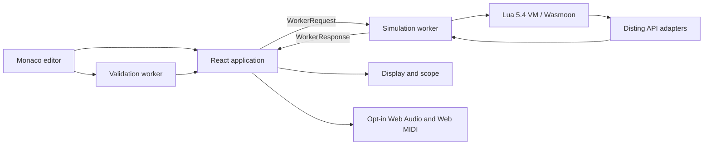

# Luading architecture

This document describes the architecture of Luading - Disting NT Lua Simulator,
the boundaries between its browser processes, and the rules for extending it.

The project prioritizes fidelity to the Disting NT Lua 1.12 contract. The
simulator is not a cycle-accurate hardware emulator: browser timing, Web Audio,
and mocked physical interfaces are explicitly separated from hardware contract
behavior.

## System overview

Luading is a static React and TypeScript application built with Vite. It runs
entirely in the browser and requires no application server or database.

There are four relevant execution contexts:

1. The browser main thread renders React controls, the simulated display, scope,
   diagnostics, and runtime telemetry.
2. The simulation Web Worker owns the Lua VM and real-time simulation state.
3. The validation Web Worker performs source analysis without blocking editing
   or simulation.
4. Monaco uses its own editor worker for language-editor services.

No React component directly owns Lua state. Communication with the simulation
worker uses the typed messages in `src/disting/types.ts`.

## Application shell

`src/main.tsx` mounts `src/App.tsx`, which renders `DistingPlayground`.
`DistingPlayground.tsx` is the main-thread coordinator. It:

- owns editor source and presentation state;
- creates, replaces, and terminates workers;
- sends typed user actions to the simulation worker;
- rejects stale validation-worker responses;
- appends trace data to an opaque, bounded `TraceHistory` for the scope and
  audio router;
- acknowledges simulator frames only after the matching React commit; and
- pauses simulation when the page is hidden.

The trace history is intentionally not stored in React state or exposed as an
enumerable component prop. A scalar revision causes consumers to read its latest
snapshot. This keeps React's development profiler from recursively cloning and
retaining thousands of nested trace samples on every 20 fps frame. Development
bootstrapping also bounds accumulated User Timing measures; production builds
do not install that cleanup.

The application is served at `/`. Vercel permanently redirects the former
`/disting` route to `/`.

### Workbench presentation boundary

The fixed-height workbench is a presentation layer over `DistingPlayground`;
it does not communicate with either worker. Its main boundaries are:

- `workbench/` owns the command bar, desktop split, responsive
  Editor/Instrument mode, bottom drawer, layout presets, shortcuts, and
  persisted presentation preferences.
- `controls/` owns reusable pointer, wheel, keyboard, exact-entry, tooltip, and
  popover behavior. It receives values and callbacks rather than simulator
  state.
- `device/` adapts the display, front-panel events, and parameter metadata to
  the shared controls.
- `io/` presents input sources, output traces, scope assignment, and opt-in
  browser routing. The command bar owns Web MIDI permission and Disting MIDI
  destination selection. Signal generation and reusable routing behavior
  remain in `emulation/`.
- `drawer/` presents scope, diagnostics, console, and browser-local performance
  data. Its pure selection and filtering helpers remain independently tested.

`useWorkbenchLayout` persists only split position, drawer geometry and tab,
density, workspace preset, and the narrow Editor/Instrument choice. Below
900 CSS pixels, only the selected Editor or Instrument tab is rendered into the
accessibility tree; desktop keeps both split regions available. Coarse-pointer
media queries select the larger touch density without changing the saved
compact or comfortable preference.

Inactive drawer workspaces remain mounted so filters and local view state are
preserved, but their memoized panels do not consume live frame work. Popovers
own transient focus behavior and return focus to their trigger when closed.

## Simulation worker

`src/disting/disting.worker.ts` is the runtime orchestrator. It owns:

- Lua VM creation and disposal;
- the 1 ms control-step scheduler;
- the 30 fps draw scheduler;
- 20 fps main-thread frame delivery;
- input-edge detection;
- output state and trace batching;
- callback timing and runtime diagnostics;
- front-panel and MIDI event dispatch; and
- preset-state serialization.

Only one simulator frame may be awaiting a main-thread commit at a time. The
worker sets its frame-in-flight flag before posting a frame, and
`DistingPlayground` returns `frameAck` after React commits that revision. This
backpressure prevents non-urgent renders from being superseded indefinitely and
discards acknowledgements associated with a replaced worker.

The worker must remain an orchestrator. Reusable behavior belongs in
`src/disting/emulation/` so it can be tested independently.

### Script load sequence

When the UI sends a `load` request, the worker:

1. pauses and disposes the previous runtime;
2. resets clock, display, preset, telemetry, and signal state;
3. creates an isolated Wasmoon engine;
4. registers Disting constants and global API adapters;
5. registers bundled Lua modules through `package.preload`;
6. executes the script and installs its reusable callback thread and timeout
   hook through `emulation/lua-runtime.ts`;
7. restores `self.state` before calling `init`;
8. validates the raw `init` result;
9. rejects the load and closes the runtime if contract validation reports an
   error;
10. normalizes metadata through `emulation/lua-contract.ts`;
11. initializes parameters, buses, signals, UI state, and display; and
12. returns the loaded program and diagnostics to the main thread.

The production Lua runtime bridge is also used by integration and bundled-script
tests. Test-only Lua wrappers must not diverge from this path.

### Control-step data flow

Each simulated 1 ms step follows this order:

1. Sample all configured signal sources.
2. Detect typed input edges.
3. Call `trigger()` on trigger rising edges.
4. Call `gate()` on both gate edges.
5. Apply sparse output updates returned by edge callbacks.
6. Call `step(dt, inputs)`.
7. Apply sparse `step` output updates.
8. Advance simulation time and the shared musical clock.
9. Add an immutable input/output snapshot to the pending trace.

Generator and Web MIDI inputs share this exact sequence. The main thread maps
each physical MIDI message into one atomic batch of external input updates.
The worker signal bank applies held CV/gate values before the next sample and
queues trigger pulses for one high control step followed by a low control step.
This means every input value from the same MIDI message is visible before any
edge callback runs. Browser port IDs and MIDI mapping configuration never cross
into the worker or Lua runtime.

Lua bus indices are 1-based. TypeScript arrays are 0-based, and conversion must
remain confined to boundary helpers. Missing entries in a callback output table
retain their previous voltages.

## Emulation modules

The core emulator is split by hardware-facing responsibility:

- `lua-runtime.ts` loads chunks, binds lifecycle methods to `self`, registers
  Lua modules, and invokes callbacks through one runtime-owned Lua thread with
  one reusable instruction-timeout hook. The 1 kHz step boundary passes inputs
  as scalar arguments and reconstructs the Lua input table in the VM, avoiding
  per-callback Wasm function and table-bridge allocation.
- `lua-contract.ts` maps Lua `init` tables, constants, buses, names, parameters,
  output modes, and MIDI metadata into typed host data.
- `parameter-model.ts` owns the Lua Script algorithm's combined firmware-wide
  parameter namespace: the fixed 85 system slots, script-relative values,
  lookup, clamping, and integer/scaled quantization.
- `runtime-helpers.ts` applies callback output tables, detects trigger/gate
  edges, filters MIDI, normalizes serialized state, and maps runtime errors.
- `display-api.ts` implements Disting drawing globals and emits
  renderer-independent draw commands.
- `display-font.ts` measures and rasterizes text from firmware-derived Selawik
  and pixelmix atlases without using browser fonts.
- `display-bounds.ts` detects text whose actual rasterized glyph bounds extend
  outside the hardware framebuffer.
- `display-renderer.ts` rasterizes commands onto the 256x64 canvas and
  quantizes atlas coverage to the display's 16-shade black-to-`#02F1EF`
  palette.
- `signal-sources.ts` implements deterministic CV, gate, trigger, sequencer,
  noise, shared-clock sources, normalized piecewise-linear Freeform CV points,
  editable gate-sequencer patterns, and browser-agnostic external held values
  and queued pulses. Gate patterns and Freeform points are browser-local input
  configuration, reuse the existing cycle timing and phase model, and do not
  extend the Lua contract.
- `simulator-defaults.ts` reads optional trailing Lua comments beside `init()`
  input/output entries and maps them to browser-only signal-generator and audio
  routing defaults without extending the firmware-facing Lua contract.
- `preset-api.ts` provides deterministic companion algorithms for preset and
  parameter APIs.
- `hardware-api.ts` clamps and records MIDI/I2C operations. It never accesses
  physical hardware.
- `scope-model.ts` selects triggers and trace windows independently of React.
- `trace-history.ts` bounds high-frequency input/output samples and keeps the
  nested history opaque to React development instrumentation.
- `audio-routing.ts` turns dense output traces into musical events.
- `web-audio.ts` owns the opt-in browser audio graph and synthesized voices.
- `midi-routing.ts` preserves the documented `sendMIDI()` destination bits,
  resolves them to unique browser MIDI output IDs, and converts mapped CC,
  pitch-bend, note pitch, velocity, gate, and trigger messages into atomic
  external input updates. It also converts output traces into rate-limited MIDI
  CC, pitch-bend, and note/gate events while tracking notes that require cleanup.
- `web-midi.ts` owns opt-in Web MIDI permission, port snapshots, input
  listeners, hot-plug reconciliation, sending, and cleanup on the main thread.

`io/useOutputRouting.ts` is the main-thread output coordinator. It advances one
fresh-trace cursor, then gives each channel to exactly one Off, WebAudio, or Web
MIDI route. MIDI events preserve relative simulated timing and are scheduled
with a small browser-local lead. Route changes, program replacement, port
disconnects, reconnection, and component cleanup release notes owned by
Luading; failed note-off cleanup is retried when its physical port reconnects.

Web Audio and Web MIDI device selection are browser conveniences. Web MIDI
messages entering `midiMessage()` and leaving `sendMIDI()` still cross the
production worker protocol and firmware-facing adapters; permissions, physical
port identities, and browser scheduling are not part of the Disting contract.
Web Audio never feeds values back into the simulation. Web MIDI scheduling is
browser-local behavior and is not evidence of calibrated Disting NT timing.

## Display and front panel

Lua drawing calls are legal only while `draw()` is active. The display adapter
supports integer and smooth primitives, 16 shades, standard and tiny text,
alignment, and the standard parameter line. Standard and tiny text use
pre-rasterized atlases generated from the Selawik and pixelmix fonts embedded in
the 1.12 firmware, so glyphs and metrics do not vary by browser or operating
system.
Both faces place each glyph from the bitmap-top metric relative to the baseline
supplied by the script.

If `draw()` returns true, the default parameter line is suppressed. An explicit
`drawStandardParameterLine()` call still requests it.

Custom algorithm UI is enabled when `ui()` returns true. Pot, encoder, and button
events then dispatch to script callbacks. Without custom UI, pot events use the
standard parameter-selection and value behavior.

## Validation architecture

Validation deliberately has four layers:

1. Syntax validation compiles source in the validation worker with the
   simulator's Lua 5.4 `load(source, "@script.lua", "t")` implementation. It
   never invokes the returned chunk and therefore cannot run user code.
2. Static validation inspects source without executing it. It finds API misuse,
   real-time hazards, drawing outside `draw`, read-only parameter writes, and
   clarity issues.
3. Contract validation inspects the raw program and `init` result. It validates
   callbacks, buses, names, parameter forms, and MIDI filters before metadata is
   normalized.
4. Runtime validation observes actual callback results, invalid voltages,
   undeclared outputs, drawing context, Lua errors, and browser-local timing.

The validation worker eagerly initializes one Wasmoon engine and serializes
compile requests through it. The runtime bridge installs one reusable trusted
compile function per engine, avoiding repeated `doString` setup and allowing
discarded chunks to be collected. Compiler errors are reported with the source
version, Lua line, and an inferred token column when Lua names the nearby token.
These findings mean “compatible with the simulator's Lua 5.4 runtime”; they do
not claim exact Disting NT firmware-version parity.

`validation/api-manifest.ts` is the canonical language-contract catalog for
firmware-facing global functions, constants, and lifecycle callbacks. Function
entries describe typed parameters, overloads, optional/default values, bounded
variadics, return multiplicity, provenance, and simulator support. Constant
entries provide the values registered in the Lua VM together with their input,
output, unit, scale, or compatibility-alias category. Lifecycle entries provide
callback signatures, script kind, cadence, return semantics, provenance, and
editor snippets.

Monaco creates the script model as `disting-lua` at the stable
`inmemory://disting/main.lua` URI. The language is registered from a local Lua
5.4 configuration and Monarch tokenizer so its indentation, long-bracket
strings and comments, operators, numerals, and Disting token categories do not
depend on Monaco's generic Lua contribution. Disting completion, hover, and
signature providers register only for this model language. Their registrations
and the language configuration/tokenizer are disposable and replaced safely
during hot updates; the base language ID itself is registered only once.

The application imports Monaco's slim `editor.api` entry point and explicitly
loads the UI contributions corresponding to registered providers. Hover,
suggestions/snippets, parameter hints, code actions, document symbols, folding,
definition, rename, quick outline, and reference-search affordances therefore
remain inside the lazy Monaco chunk while still having visible controllers and
keyboard commands.

The runtime constant table, static API arity checks, contract callback checks,
and Monaco Disting completions all derive from this catalog. Manual-backed,
hardware-verified, official-corpus, and simulator-extension provenance remain
separate from the `full`, `partial`, `approximation`, `mock`, or `unsupported`
simulator support level. This prevents editor documentation from presenting an
observed compatibility alias as a documented hardware contract, while still
making simulator limitations visible.

`validation/score.ts` is the only module that converts findings into the
100-point quality score. Compatibility notes and browser-local timing must not
be misrepresented as hardware contract failures.

## Editor architecture

`editor/DistingCodeEditor.tsx` owns Monaco's text model. Source text is not
mirrored through React on every keystroke, preventing editor activity from
rerendering the display, scope, and runtime controls.

`editor/disting-intellisense-context.ts` performs pure cursor analysis over
source text and the compact index. `editor/disting-intellisense.ts` is the thin
Monaco adapter for contextual completions, hovers, and signature help. It
caches an index by Monaco model version and does not communicate with the
simulation worker.

`editor/disting-navigation-context.ts` provides the corresponding pure outline,
local-symbol, and folding analysis. `editor/disting-navigation.ts` adapts it to
Monaco document-symbol, definition, rename, and folding providers. The outline
contains lifecycle callbacks, local functions, algorithm and `init()` metadata,
and named script parameters. Definition and rename are intentionally limited to
locals, local functions, and callback parameters that resolve through a
complete current-version index; globals, members, table keys, comments, and
strings are never rewritten. Callback bodies, local functions, and metadata
tables spanning at least three lines receive explicit folding ranges.

Completion lists follow the surrounding Disting structure: returned program
fields and lifecycle callbacks, `init()` metadata, input/output constant
categories, numeric parameter units and scales, parameter definition variants,
MIDI filters, display modes, text alignment, and documented `self` members.
Already-declared fields are omitted. Local declarations, function names, and
callback parameters come from their indexed source scopes; Monaco's generic
document-word suggestions are disabled. Manual-backed entries sort before Lua
globals and compatibility-only entries.

Signature help uses a balanced Lua call scan rather than a line-limited regular
expression, so nested calls, tables, strings containing commas, and multiline
arguments preserve the active parameter. Every catalog overload is shown, with
the table form selected when the current overload argument begins with a table
constructor. Statically indexed `self.parameters[n]` expressions display the
matching script parameter name in hover documentation.

Hover documentation also covers Disting APIs and constants, supported Lua
globals and library members, Lua 5.4 keywords, lifecycle and metadata fields,
and confidently resolved local symbols. Metadata names are matched through
their indexed source ranges rather than globally, so a local variable called
`name` is not described as algorithm metadata.

`validation/source-index.ts` is the compact structural layer used for source
mapping. It scans Lua tokens without executing source, balances delimiter and
Lua block pairs, and indexes returned program fields, lifecycle callbacks,
`init()` metadata, parameter definitions, Disting API calls and argument spans,
and local/function declarations, including whether function bindings are local.
It also follows simple local table references used by returned program and
metadata tables. Wasmoon compilation remains the syntax authority; an
incomplete structural scan produces a partial index and does not block
validation or editing. Navigation that could edit or redirect a symbol is
withheld for an incomplete index.

The validation worker creates the index alongside syntax and static findings
and returns both with the same model version. The application rejects the
entire response after a subsequent edit. Contract findings carry semantic
location hints such as `init.outputs` or `parameters[2].default`, while runtime
callback findings fall back to `callback:<name>`. These hints are resolved only
through an index whose version matches the current editor source, so load-time
and runtime diagnostics can navigate to useful source without trusting stale
ranges.

`validation/diagnostic-actions.ts` defines quick fixes as domain-level source
edits, without importing Monaco types. The deliberately bounded action set can
insert header comments, identity fields, edge/MIDI callbacks and metadata,
replace invalid categorized constants, add required drawing colour, and rewrite
simple direct parameter assignments through `setParameter()`. Transformations
that require moving or interpreting arbitrary callback code are not offered.
Every inserted callback expands catalog snippet defaults to ordinary Lua before
the edit is exposed.

`editor/diagnostic-code-actions.ts` adapts those edits to Monaco workspace edits
for the current model version. `editor/diagnostic-markers.ts` clamps source
ranges and assigns separate syntax, static, contract, and runtime marker owners.
Marker hover text stays concise while Problems retains diagnostic detail and
suggestions. Marker source identifies both the Disting NT Lua 1.12 profile and
the diagnostic origin. Contract and runtime owners are cleared synchronously on
model edits before React or either worker responds.

No document formatter is registered. Phase 7 requires Lua 5.4 compatibility
and corpus-wide idempotence before formatting can become an editor action; no
browser-compatible formatter currently meets that project gate. Inlay hints are
also omitted until the workbench has an explicit opt-in preference, avoiding
always-on parameter/input/output annotations in compact scripts.

## Testing boundaries

The tests mirror the production boundaries:

- manual conformance tests pin the public Disting NT Lua 1.12 contract;
- emulator unit tests cover pure boundary behavior;
- Wasmoon integration tests execute the production Lua runtime bridge;
- corpus tests load and exercise every bundled Lua script; and
- coverage thresholds guard the selected simulator core.

See `docs/TESTING.md` for commands, thresholds, and the detailed test matrix.

## Build and deployment

Vite produces a static `dist/` directory containing the application, workers,
Lua WASM runtime, Monaco chunks, and assets. `vercel.json` defines:

- `npm ci` as the reproducible install command;
- `npm run build` as the production build;
- `dist` as the output directory; and
- permanent legacy-route redirects.

The GitHub Actions workflow runs `npm run check` on pull requests and pushes to
`main`. Vercel is connected separately for static production deployment.

## Extension rules

### Adding a Disting global API

1. Add the public signature to `validation/api-manifest.ts`.
2. Implement behavior in an `emulation/` adapter.
3. Register the adapter in the simulation worker.
4. Add focused unit and Lua-boundary tests.
5. Update manual conformance coverage when the public contract changes.

### Adding lifecycle or worker behavior

1. Add typed request or response fields to `types.ts`.
2. Keep scheduling and dispatch in the worker.
3. Extract reusable state transitions into `emulation/`.
4. Add regression tests before connecting React controls.

### Adding a signal source

1. Extend the `SignalShape` type.
2. Add it to the visible source catalog.
3. Implement the exhaustive `signalValueAt` branch.
4. Test normalization, phase behavior, and deterministic output.

### Adding validation

Every finding needs:

- a stable rule ID;
- an origin of static, contract, or runtime;
- a target of hardware, simulator, or local;
- a severity appropriate to the certainty of the finding; and
- a bounded score penalty when applicable.

Static heuristics should not become contract errors unless runtime or raw
contract evidence proves the violation.

## Related documentation

- `docs/TESTING.md` - test layers, commands, and coverage policy
- `src/disting/ARCHITECTURE.md` - lower-level emulator implementation notes
- `docs/Disting NT Lua Scripting 1.12.pdf` - current firmware-facing contract
