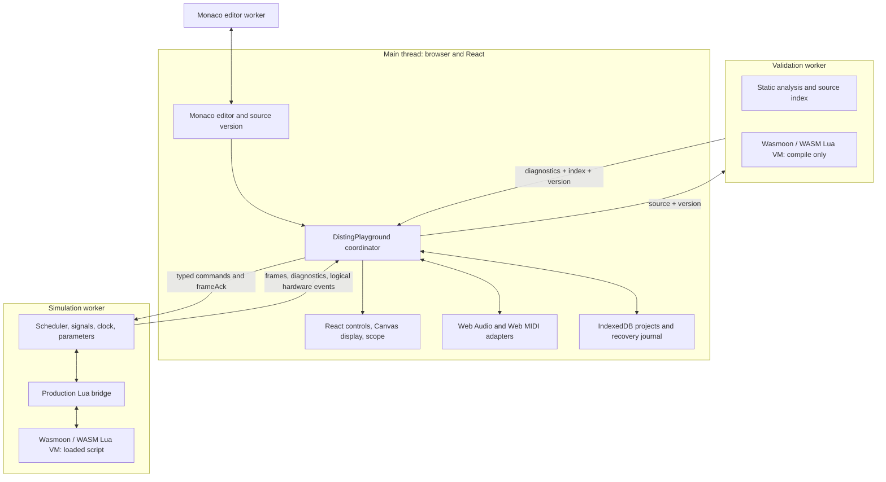
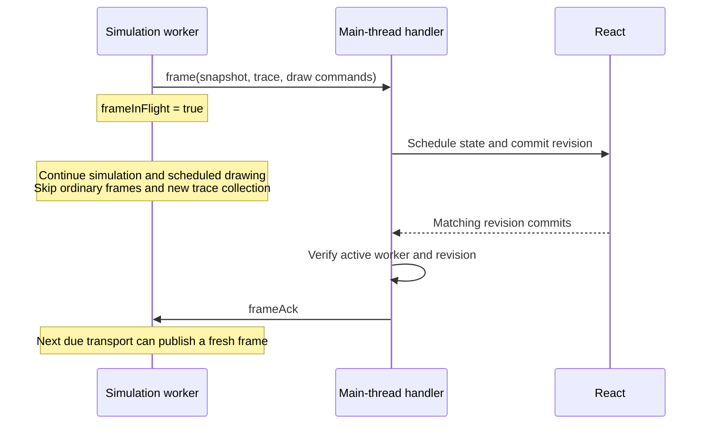
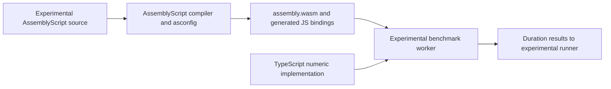

# WASM and Web Workers in Luading: architecture for a talk

> Talk companion, inspected on 2026-09-09. [ARCHITECTURE.md](ARCHITECTURE.md)
> remains the canonical architecture reference. This document explains the
> existing implementation; it does not propose a new architecture or establish
> hardware conformance. Source line numbers refer to the inspected checkout and
> can drift; each excerpt also includes a path and searchable code.

## 1. The central story

Luading lets a musician edit, validate, and run Disting NT Lua scripts inside a
browser. The interesting engineering problem is running user-authored code while
keeping the editor responsive, preserving Lua semantics, and presenting a useful
simulation despite irregular browser scheduling.

The production solution combines **a Lua VM delivered as WebAssembly** with
**dedicated Web Workers** and **explicit message protocols**. These solve different
problems: WASM supplies the language runtime; workers give execution a separate
event loop and a replaceable lifetime; the protocol controls ownership and the
rate at which simulation results become UI state.

| Technology | Actual role in this repository | Problem addressed |
| --- | --- | --- |
| WebAssembly through Wasmoon | Lua 5.4 runtime in simulation and validation workers | Run and compile Lua with a real Lua runtime instead of approximating its language in JavaScript |
| Web Workers | Separate simulation and validation contexts; an additional Monaco editor worker supports editor services | Keep script work away from the DOM event loop and allow the simulation worker to be terminated |
| TypeScript and React | Main-thread coordination, typed commands, editor and views | Make state ownership and user interaction explicit |
| AssemblyScript | Tracked benchmark experiment under `src/as/`, outside production | An optional teaching example of compiling numeric functions to WASM; it does not power the Disting workbench |

Production entry evidence is [`src/App.tsx`, lines 1–7](../src/App.tsx#L1-L7): it
renders `DistingPlayground`. The application runs at `/`; `/disting` is a
compatibility redirect. The AssemblyScript experiment is discussed separately in
section 10 and must not appear as a production component on a slide.

**Speaker framing:** “We needed to run another language without letting it own
our interface. WASM gives us the runtime, workers give us an execution boundary,
and flow control makes the boundary usable.”

## 2. Production execution topology



The two Wasmoon engines have separate lifetimes and Lua state. The validation VM
is retained across edits; the simulation worker and VM are replaced on reload.
The Monaco worker is editor infrastructure, not a simulation engine.

Only the main thread owns DOM nodes, storage coordination, file handoffs, audio,
MIDI permissions, and physical device identities. The simulation worker owns the
Lua program, callbacks, inputs, output voltages, parameters, simulated clock, and
control loop. Views receive snapshots and callbacks; they do not read the VM.
This avoids competing authorities for mutable simulation state.

The topology and wider persistence/designer flows are covered in the canonical
[architecture](ARCHITECTURE.md). The talk focuses on the execution boundaries.

## 3. Loading WASM is different from choosing where it executes

The simulation worker imports Wasmoon's packaged WASM as a Vite asset URL:

Source: [src/disting/disting.worker.ts, lines 3–4](../src/disting/disting.worker.ts#L3-L4).

```ts
import { LuaFactory } from 'wasmoon'
import wasmoonWasmUrl from 'wasmoon/dist/glue.wasm?url'
```

Source: [src/disting/disting.worker.ts, lines 66–71](../src/disting/disting.worker.ts#L66-L71).

```ts
const workerScope = self as unknown as DedicatedWorkerGlobalScope
const factory = new LuaFactory(wasmoonWasmUrl)
const STEP_MS = DISTING_DISPLAY.stepSeconds * 1000
const DRAW_INTERVAL_MS = 1000 / DISTING_DISPLAY.drawFps
const FRAME_INTERVAL_MS = 1000 / 20
const MAX_CATCH_UP_STEPS = 50
```

The main thread explicitly creates a module worker:

Source: [src/disting/DistingPlayground.tsx, lines 433–441](../src/disting/DistingPlayground.tsx#L433-L441).

```ts
  const createWorker = useCallback(() => {
    terminateWorker()
    const worker = new Worker(new URL('./disting.worker.ts', import.meta.url), { type: 'module' })
    workerRef.current = worker
    worker.onmessage = (event: MessageEvent<WorkerResponse>) => {
      if (worker !== workerRef.current) return
      handleWorkerMessage(event.data, worker)
    }
    worker.onerror = (event) => {
```

These are two independent choices. `LuaFactory` supplies the VM;
`new Worker(...)` chooses the execution context. WASM alone would not move work
off the main thread. Within the simulation worker, TypeScript scheduling and Lua
execution still run sequentially; each Lua callback is synchronous.

This project loads an existing Lua interpreter compiled to WASM. It does **not**
compile each edited Lua script to WASM. Lua source is compiled/loaded by Lua
inside that VM. Likewise, the Lua “thread” used by the callback bridge is a Lua
runtime object, not another browser worker or evidence of parallel WASM threads.

The root build is `tsc -b && vite build` in
[`package.json`, line 13](../package.json#L13). It packages the dependency's WASM
asset and worker entry points. [`vite.config.ts`, lines 6–18](../vite.config.ts#L6-L18)
stubs Node built-ins that Wasmoon references behind browser-inactive guards;
these stubs do not provide filesystem access inside the browser.

**Problem solved:** the runtime can ship with a static browser application,
while compute runs outside the event loop responsible for editing and input.
The tradeoffs include WASM/worker startup, separate VM memory, and bridge costs.

## 4. Messages make state ownership concrete

The shared protocol uses a discriminated union. Here is the start of the request
union; further variants cover parameters, controls, MIDI, and serialization:

Source: [src/disting/types.ts, lines 318–328](../src/disting/types.ts#L318-L328).

```ts
export type WorkerRequest =
  | { type: 'load'; source: string; modules?: Record<string, string>; state?: unknown }
  | { type: 'start' }
  | { type: 'pause' }
  | { type: 'frameAck' }
  | { type: 'resetTelemetry' }
  | { type: 'setInputSource'; index: number; config: SignalSourceConfig }
  | { type: 'setExternalInputSource'; index: number; value: number }
  | { type: 'externalInput'; updates: ExternalInputUpdate[] }
  | { type: 'setClock'; config: GlobalClockConfig }
  | { type: 'setParameter'; index: number; value: number }
```

Frames carry data, not references to Lua objects or DOM nodes:

Source: [src/disting/types.ts, lines 344–352](../src/disting/types.ts#L344-L352).

```ts
  | {
      type: 'frame'
      trace: TracePoint[]
      inputs: number[]
      outputs: number[]
      parameterValues: number[]
      stats: RuntimeStats
      display: DrawCommand[]
    }
```

The production `post` helper calls `workerScope.postMessage(message)` with no
transfer list ([worker lines 118–120](../src/disting/disting.worker.ts#L118-L120)).
This path uses cloned message data, not shared WASM memory, `SharedArrayBuffer`,
or zero-copy transfer of the Lua heap. The TypeScript types aid development;
they are not runtime validation of arbitrary messages.

For MIDI input, only bytes or voltage-update batches cross the boundary.
For output, Lua `sendMIDI` reaches a worker hardware adapter, which emits a
logical event; the main thread resolves actual browser ports. See
[worker lines 122 and 443–445](../src/disting/disting.worker.ts#L443-L445).

**Problem solved:** ownership remains understandable across concurrency
boundaries, and firmware-facing script behavior stays independent of browser
permissions and device names. The cost is serialization and deliberately
asynchronous control delivery.

## 5. Script loading and the JavaScript/Lua boundary

```mermaid
sequenceDiagram
  participant UI as Main-thread coordinator
  participant W as New simulation worker
  participant L as Wasmoon Lua VM
  UI->>W: Create module worker
  W-->>UI: ready
  UI->>W: load(source, modules, optional saved state)
  Note over UI: Start two-second load watchdog
  W->>L: Create engine; register globals and modules
  W->>L: Evaluate chunk and obtain program table
  W->>L: Configure indices; restore state; invoke init
  W->>W: Validate raw program and init result
  alt Blocking contract errors
    W->>L: Close runtime and engine
    W-->>UI: error + diagnostics
  else Valid contract
    W->>W: Normalize metadata and initialize models
    W-->>UI: loaded
    UI->>W: start, unless document is hidden
  end
```

The raw result is validated before defaults can hide malformed script metadata:

Source: [src/disting/disting.worker.ts, lines 498–516](../src/disting/disting.worker.ts#L498-L516).

```ts
    if (restoredState !== undefined) runtime.setState(restoredState)
    currentAlgorithmIndex = program.algorithmIndex

    const rawInitResult = runtime.init
      ? measureCallback('init', () => runtime?.init?.())
      : undefined
    const diagnostics = validateProgramContract(program, rawInitResult)
    if (blocksContractExecution(diagnostics)) {
      const errorCount = diagnostics.filter((diagnostic) => (
        diagnostic.origin === 'contract' && diagnostic.severity === 'error'
      )).length
      closeEngine()
      post({
        type: 'error',
        message: `${errorCount} contract ${errorCount === 1 ? 'error prevents' : 'errors prevent'} this script from running.`,
        diagnostics,
      })
      return
    }
```

A central bridge wraps callbacks in Lua so that `self` is the actual program
table. For `step`, JavaScript inputs arrive as scalar arguments and become a
reused, 1-based Lua table:

Source: [src/disting/emulation/lua-runtime.ts, lines 234–248](../src/disting/emulation/lua-runtime.ts#L234-L248).

```lua
      if type(program.step) == "function" then
        local inputs = {}
        local previousInputCount = 0
        runtime.step = function(dt, ...)
          local inputCount = select("#", ...)
          for index = 1, inputCount do
            inputs[index] = select(index, ...)
          end
          for index = inputCount + 1, previousInputCount do
            inputs[index] = nil
          end
          previousInputCount = inputCount
          return program:step(dt, inputs)
        end
      end
```

This excerpt is Lua embedded in a TypeScript template string. Reuse avoids
constructing a fresh Lua input table on every control step. Clearing entries
above the current count prevents stale values if the input count shrinks.
`program:step(...)` preserves Lua method-call semantics. The JavaScript side
spreads inputs into the dispatcher at
[`lua-runtime.ts`, lines 319–324](../src/disting/emulation/lua-runtime.ts#L319-L324).

Host APIs cross the bridge in the other direction. This small example routes
Lua output into a worker message:

Source: [src/disting/disting.worker.ts, lines 356–358](../src/disting/disting.worker.ts#L356-L358).

```ts
  apiGlobals.set('print', (...values: unknown[]) => {
    post({ type: 'log', line: values.map(String).join('\t') })
  })
```

The registration wrapper also requires Disting API names to exist in the
manifest ([worker lines 338–350](../src/disting/disting.worker.ts#L338-L350)).
The manifest records simulator support and provenance; it is not evidence that
every adapter exactly reproduces hardware.

**Problem solved:** language conversion is centralized instead of rediscovered
in every UI or callback. This matters for `self`, 1-based indexing, modules, and
sparse outputs. Missing callback returns and absent output entries retain prior
voltages; they are not zero-filled. See
[`runtime-helpers.ts`, line 28](../src/disting/emulation/runtime-helpers.ts#L28)
and its [focused tests](../src/disting/emulation/runtime-helpers.test.ts).

## 6. Three cadences, one simulation owner

| Activity | Configured cadence | Meaning |
| --- | --- | --- |
| Simulation control step | 1 ms, `dt = 0.001` | Fixed increment of simulated time |
| Lua draw callback | Target 30 fps | Build the latest display command list |
| Worker frame transport | Target 20 fps | Publish a snapshot when no frame is outstanding |
| Browser timer wake-up | Requested every 8 ms | Opportunity to do accumulated work; not a timing guarantee |

Constants are in [`types.ts`, lines 1–7](../src/disting/types.ts#L1-L7) and
[worker lines 68–71](../src/disting/disting.worker.ts#L68-L71); the timer is
started at [worker lines 778–784](../src/disting/disting.worker.ts#L778-L784).
Drawing also occurs on certain load/control paths, so 30 fps describes the
running scheduler rather than a universal limit on all calls.

```mermaid
flowchart LR
  Wake["Browser timer wake-up"] --> Acc["Accumulate elapsed wall time"]
  Acc --> Cap["Compute due steps; cap at 50"]
  Cap --> Sample["Sample inputs"]
  Sample --> Edges["Trigger/gate callbacks; sparse output updates"]
  Edges --> Step["step with dt 0.001; sparse output updates"]
  Step --> Advance["Advance simulation clock; collect trace if allowed"]
  Advance -->|"More due steps"| Sample
  Advance -->|"Batch finished"| Draw["Draw if due"]
  Draw --> Frame["Send frame if due and none in flight"]
```



The accumulator translates an irregular timer into fixed-size simulation steps:

Source: [src/disting/disting.worker.ts, lines 747–760](../src/disting/disting.worker.ts#L747-L760).

```ts
    const now = performance.now()
    accumulatorMs += Math.min(now - lastWallTime, 250)
    lastWallTime = now

    let dueSteps = Math.floor(accumulatorMs / STEP_MS)
    if (dueSteps > MAX_CATCH_UP_STEPS) {
      droppedSteps += dueSteps - MAX_CATCH_UP_STEPS
      dueSteps = MAX_CATCH_UP_STEPS
      accumulatorMs = 0
    } else {
      accumulatorMs -= dueSteps * STEP_MS
    }

    for (let index = 0; index < dueSteps; index += 1) runStep()
```

Elapsed wall time is itself clamped to 250 ms before accumulation. If more
than 50 steps are due, the worker counts the excess as dropped and discards the
remaining accumulator. Consequently, the dropped-step counter is not a complete
account of all wall time lost during a long suspension.

The control-step order is visible at
[worker lines 689–715](../src/disting/disting.worker.ts#L689-L715): sample inputs,
dispatch edges and their output updates, call `step`, apply its output updates,
advance time, then optionally record a snapshot. A long delay does not become
one giant `dt` passed into the script.

**Problem solved:** scripts see consistent step sizes and edge ordering, while
bounded catch-up avoids an ever-growing backlog of simulation work. Under load,
simulated time can fall behind wall time. The browser is not a real-time control
system or a cycle-accurate Disting NT emulator; telemetry is local observation,
not calibrated hardware CPU usage.

## 7. Backpressure: wait for a committed UI frame

A worker can remain responsive internally while flooding the main thread with
old results. Luading allows only one ordinary frame in flight. `postFrame`
checks and sets `frameInFlight` before sending its snapshot:

Source: [src/disting/disting.worker.ts, lines 718–725](../src/disting/disting.worker.ts#L718-L725).

```ts
function postFrame(trace: TracePoint[]) {
  if (frameInFlight) return false
  frameInFlight = true
  post({
    type: 'frame',
    trace,
    inputs: [...inputs],
    outputs: [...outputs],
```

The acknowledgement is sent from a React layout effect after the matching
revision commits:

Source: [src/disting/DistingPlayground.tsx, lines 450–456](../src/disting/DistingPlayground.tsx#L450-L456).

```ts
  useLayoutEffect(() => {
    const worker = frameCommitGateRef.current.commit(
      committedFrameRevision,
      workerRef.current,
    )
    worker?.postMessage({ type: 'frameAck' } satisfies WorkerRequest)
  }, [committedFrameRevision])
```

[`FrameCommitGate`, lines 19–24](../src/disting/frame-commit.ts#L19-L24)
requires both the pending revision and active worker identity to match.
The worker clears its in-flight flag on `frameAck`
([lines 855–857](../src/disting/disting.worker.ts#L855-L857)).



This bounds ordinary frame backlog, and skipping trace collection while a frame
is outstanding bounds that pending trace growth. It intentionally loses trace
samples under pressure: the scope is not a lossless recorder. Other messages,
such as logs and hardware events, are separate from this frame gate.

The acknowledgement means **React committed the matching state**, not that a
monitor has painted the frame. Canvas drawing is performed separately by
[`DistingDisplay`, lines 12–18](../src/disting/DistingDisplay.tsx#L12-L18).
Lua draws into a command list in the worker; the main thread rasterizes it at
256×64 pixels with 16 shades. No canvas object crosses into Lua.

**Problem solved:** UI speed constrains publication rather than accumulating
an unbounded queue of obsolete frames. Splitting command generation from Canvas
rendering also makes display behavior testable without a DOM inside the VM.

## 8. Editor validation must not run the user's script

The validation worker keeps a separate engine promise across requests:

Source: [src/disting/validation.worker.ts, lines 12–23](../src/disting/validation.worker.ts#L12-L23).

```ts
const workerScope = self as unknown as DedicatedWorkerGlobalScope
const factory = new LuaFactory(wasmoonWasmUrl)
const enginePromise = factory.createEngine()
const validationService = createLuaValidationService(() => enginePromise)

workerScope.onmessage = (event: MessageEvent<ValidationWorkerRequest>) => {
  if (event.data.type !== 'validate') return
  const { source, version } = event.data
  const sourceIndex = createLuaSourceIndex(source, version)
  void validationService.validate(source).then((diagnostics) => {
    workerScope.postMessage(createValidationResponse(version, diagnostics, sourceIndex))
  })
```

The compile helper asks Lua to compile text, then discards the returned
function without invoking it:

Source: [src/disting/emulation/lua-runtime.ts, lines 58–63](../src/disting/emulation/lua-runtime.ts#L58-L63).

```lua
        _G.${COMPILE_GLOBAL} = function(source, chunkName)
          local compiledChunk, loadError = load(source, chunkName, "t")
          compiledChunk = nil
          collectgarbage("step")
          return loadError
        end
```

This is another embedded Lua excerpt. Typing a source file containing an
infinite loop does not run that loop during syntax checking. Static checks and
a structural source index supplement Lua compilation; they do not replace the
Lua compiler as syntax authority. Actual contract checks happen during Run,
after evaluating the chunk and `init` in the simulation worker.

The main thread debounces edits by 250 ms and sends a monotonically increasing
source version. On return, it rejects diagnostics and indexes for old versions:

Source: [src/disting/DistingPlayground.tsx, lines 628–632](../src/disting/DistingPlayground.tsx#L628-L632).

```ts
    validationWorker.onmessage = (event: MessageEvent<ValidationWorkerResponse>) => {
      if (!isCurrentValidationResponse(event.data, validationVersionRef.current)) return
      setStaticDiagnostics(event.data.diagnostics)
      setSourceIndex(event.data.sourceIndex)
    }
```

The debounce is at [coordinator lines 639–650](../src/disting/DistingPlayground.tsx#L639-L650).
The validation service serializes compile work through a promise queue and
reuses its engine ([syntax-validator lines 84–101](../src/disting/validation/syntax-validator.ts#L84-L101)).
Version rejection prevents stale UI results; it does not cancel queued work.

```mermaid
sequenceDiagram
  participant E as Editor and coordinator
  participant V as Validation worker
  E->>V: validate(source A, version 10)
  Note over E: User edits again; current version becomes 11
  V-->>E: diagnostics and source index, version 10
  Note over E: Discard stale result
  E->>V: validate(source B, version 11), after debounce
  V-->>E: diagnostics and source index, version 11
  Note over E: Accept current result
```

**Problem solved:** expensive validation is separated from both the editor
thread and the live simulation, and old results cannot attach diagnostics or
navigation locations to newer source. The tradeoff is a second VM and queued
validation work.

## 9. Failure containment needs more than a worker

A synchronous runaway callback also blocks its worker's message handler, so a
queued `pause` command alone cannot interrupt it. The runtime installs a Lua
instruction-count hook with a deadline. Defaults are 25 ms and a hook every
1,000 instructions ([lua-runtime lines 10–11](../src/disting/emulation/lua-runtime.ts#L10-L11)).

Source: [src/disting/emulation/lua-runtime.ts, lines 114–118](../src/disting/emulation/lua-runtime.ts#L114-L118).

```ts
  const hookPointer = callbackThread.lua.module.addFunction(() => {
    if (Date.now() <= deadline) return
    callbackThread.pushValue(new LuaTimeoutError('thread timeout exceeded'))
    callbackThread.lua.lua_error(callbackThread.address)
  }, 'vii')
```

The invoker resets the deadline for each call and invokes Lua through a
protected call. It clears the hook and stack in `finally`, then removes the
registered function and closes the Lua thread on cleanup
([lua-runtime lines 136–175](../src/disting/emulation/lua-runtime.ts#L136-L175)).
The hook is reused across calls, avoiding one registered WASM function per step.

| Failure | Existing mechanism | Limit to explain in the talk |
| --- | --- | --- |
| Top-level chunk or initialization stalls after `ready` | Main-thread two-second load timer terminates worker | Timer starts when `load` is sent after `ready`; it is not a general worker-startup or ongoing heartbeat watchdog |
| Runaway Lua callback | Instruction hook deadline; runtime error; worker pauses | Checked at hook intervals, not hard real-time preemption of arbitrary host code |
| Worker replaced while an old message arrives | Active worker identity check | Replacement resets VM state; restoration is explicit |
| UI commits a frame from an old worker | Revision/identity commit gate | Prevents acknowledging the wrong producer |
| Hidden browser document | Pause; reset traces/telemetry before automatic resume | Background execution is intentionally not continuous |

See [coordinator lines 314–331](../src/disting/DistingPlayground.tsx#L314-L331)
for the load timer, [lines 433–448](../src/disting/DistingPlayground.tsx#L433-L448)
for worker identity/error handling, [lines 652 onward](../src/disting/DistingPlayground.tsx#L652)
for visibility handling, and [worker lines 771–775](../src/disting/disting.worker.ts#L771-L775)
for tick-error recovery.

**Problem solved:** broken user scripts have a recoverable execution lifetime.
This is fault containment for the workbench, not a claim of a complete security
sandbox for hostile code or a real-time deadline guarantee.

## 10. Optional appendix: the AssemblyScript benchmark experiment

`src/as/` is tracked experimental material and is not reachable from the
production workbench. `src/lua/` is also a legacy experiment. This appendix is a
source walkthrough for the requested talk, not a proposal to activate either.
The root TypeScript application config explicitly excludes `src/as`
([tsconfig.app.json](../tsconfig.app.json)); the root production entry renders
only `DistingPlayground`.

The experiment gives a separate view of WASM: compile numeric functions rather
than embed a language interpreter. Its AssemblyScript source uses explicit
numeric types:

Source: [src/as/assembly/index.ts, lines 7–9](../src/as/assembly/index.ts#L7-L9).

```ts
export function add(a: i32, b: i32): i32 {
  return a + b;
}
```

Source: [src/as/assembly/index.ts, lines 32–36](../src/as/assembly/index.ts#L32-L36).

```ts
export function matMul(n: i32): f64 {
  const size: i32 = n * n;
  const A = new StaticArray<f64>(size);
  const B = new StaticArray<f64>(size);
  const C = new StaticArray<f64>(size);
```

The matrix function performs the nested numeric loop inside WASM and returns
a scalar checksum ([lines 44–60](../src/as/assembly/index.ts#L44-L60)). The
TypeScript comparison uses `Float64Array`, not ordinary boxed arrays
([assembly.ts lines 23–27](../src/as/assembly.ts#L23-L27)).



The worker explicitly compiles the downloaded binary and uses generated bindings:

Source: [src/as/bench.worker.ts, lines 95–103](../src/as/bench.worker.ts#L95-L103).

```ts
  try {
    // Load and instantiate the AssemblyScript WASM binary independently in this worker
    const wasmModule = await WebAssembly.compileStreaming(fetch(wasmUrl))
    const exports = (await instantiate(wasmModule, { env: {} })) as unknown as Record<string, (a: number, b?: number) => number>

    const wasmImpl: (arg: number) => number =
      fn === 'add'
        ? (n) => exports.add(n, n)
        : (n) => (exports[fn] as (a: number) => number)(n)
```

The experimental `asconfig.json` defines debug/release output to the same
`build/assembly.wasm` path, a textual `.wat`, source maps, raw bindings, and
release optimization level 3. Its nested `package.json` declares AssemblyScript;
the root build has no AssemblyScript compilation step. Tracked generated output
is therefore not proof that the root build rebuilt or validated this experiment.

**Teaching opportunity:** `matMul` keeps its inner loop and typed data inside
WASM, amortizing the JavaScript/WASM call boundary across substantial work.
The `add` case instead crosses the boundary for tiny work. These are useful
contrasts in workload design, not evidence of a universal WASM speedup.

Do not use the benchmark as a production or hardware performance claim:

- `runBench` performs 50 warm-up calls, then measures repeated calls with
  `performance.now` ([bench.worker.ts lines 48–55](../src/as/bench.worker.ts#L48-L55)).
  WASM compilation and instantiation happen outside that timed region.
- The WASM and TypeScript variants cross their call boundaries per iteration;
  the optional Lua Fibonacci measurement puts the loop inside a `doString`
  call. The paths do not measure identical bridge overhead.
- AssemblyScript `i32` results have a different numeric range from JavaScript
  `number`; sufficiently large Fibonacci results are not directly comparable.
- Matrix calls include allocations and initialization. `StaticArray` is not
  grounds for claiming that allocation/runtime-management costs disappear.
- Browser, build mode, warm-up, workload, and result correctness must be controlled
  before reporting a comparison. No benchmark was run for this document.

## 11. Evidence and a suggested talk sequence

The architecture is supported by several different test layers; none alone
proves physical Disting behavior:

| Example to show | Evidence in the project | What it establishes |
| --- | --- | --- |
| Real Lua bridge | [lua-runtime.test.ts, line 48](../src/disting/emulation/lua-runtime.test.ts#L48) | `self` and lifecycle callback behavior through Wasmoon |
| Non-executing syntax check | [lua-runtime.test.ts, line 31](../src/disting/emulation/lua-runtime.test.ts#L31) | Compiling source does not execute its chunk |
| Reused timeout hook and interruption | [lua-runtime.test.ts, lines 162 and 199](../src/disting/emulation/lua-runtime.test.ts#L162) | Repeated callbacks and runaway callback recovery at the real Lua boundary |
| Commit acknowledgement | [frame-commit.test.ts](../src/disting/frame-commit.test.ts) | Revision and worker identity gating |
| Script compatibility | [official-scripts.test.ts](../src/disting/validation/official-scripts.test.ts) and [community-scripts.test.ts](../src/disting/validation/community-scripts.test.ts) | Bundled script lifecycle compatibility, with controlled adapters |
| Hardware contract catalog | [conformance tests](../src/disting/conformance/manual-1.12.conformance.test.ts) | Documented constants and selected invariants, not full hardware equivalence |

For test-layer limits, commands, and manual acceptance requirements, use
[TESTING.md](TESTING.md). Browser timing and physical MIDI/hardware behavior need
separate environment-specific evidence.

A possible 25–30 minute sequence:

1. **The user problem (3 min):** demonstrate editing and running a Lua script;
   show why responsiveness and faithful language behavior both matter.
2. **Topology (4 min):** draw the main thread, two workers, and two Lua VMs;
   separate “what executes” from “where it executes.”
3. **The bridge (5 min):** walk from `load` to `init`, then show the Lua `step`
   wrapper, 1-based inputs, and retained sparse output values.
4. **Scheduling and flow control (6 min):** explain the three cadences and the
   one-frame acknowledgement diagram. Ask what happens if React becomes slow.
5. **Failure and validation (4 min):** show compile-only validation, version
   rejection, callback timeout tests, and the main-thread termination path.
6. **Optional AssemblyScript contrast (4 min):** show the numeric kernel and
   generated bindings as an isolated experiment; explain boundary amortization
   without inventing speedup numbers.
7. **Discussion (2 min):** identify which boundary or test would change if a new
   firmware API, browser device, or high-volume stream were introduced.

For a prepared demo, use the existing workbench and test fixtures. A runaway
callback demonstration can use the focused runtime test rather than depending
on a live browser recovering on stage. Keep speaker claims aligned with the
source: fixed simulation increments, target browser cadences, recoverable worker
execution, and a real Lua VM are demonstrated here; calibrated hardware timing,
lossless tracing, and production AssemblyScript are not.
