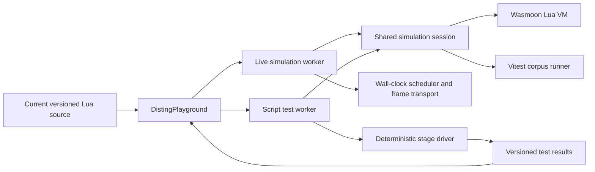

# Script-authored automated tests implementation plan

## Status

Proposed on 2026-08-03. No behavior described by this document is implemented
until the relevant increment and its verification have landed.

## Goal

Let a script author describe repeatable behavioral tests that start from one of
the script's named `luading.parameterPresets`, drive controlled input voltages
through the real Lua runtime at exact 1 ms steps, and compare observable outputs
and script parameters with expected values.

The workbench will run these tests before the script is copied to Disting NT
hardware. The same test runner will be callable by Vitest for project-owned Lua
scripts, so a passing script behavior can become a regression check against
later Luading runtime changes.

This feature has two distinct promises:

1. A passing suite means the current source behaved as declared in Luading's
   deterministic simulator for that run.
2. It does not prove cycle accuracy, analogue accuracy, browser timing, or
   behavior on physical Disting NT hardware.

Test declarations, test seeds, result records, and runner controls are Luading
simulator extensions. They must never become Disting globals or be presented as
firmware test APIs.

## Product decisions

- Tests live under a versioned `luading.tests` table in the returned program,
  beside the existing parameter presets. This keeps a script and its behavioral
  examples together and lets a test refer to a preset by its unique name.
- Version one tests only observable voltage/control-step behavior: input
  voltages, output voltages, and script-relative parameter values. MIDI, front
  panel UI, drawing, emitted hardware events, saved state, browser routing, and
  performance thresholds are deferred.
- A test case requires a valid named parameter preset. There is no implicit
  preset selection and no numeric preset reference.
- Every case runs in a fresh Lua engine. Cases cannot depend on execution order
  or leak `self`, module, random, output, parameter, clock, or edge state to one
  another.
- Test execution uses virtual time and exact 1 ms steps. It does not use
  `setInterval()`, frame transport, document visibility, or browser wall time.
- The test worker and live simulation worker share one production control-step
  implementation. The test runner must not copy the edge/callback/output order.
- Running tests never pauses, resets, or mutates the live simulation worker.
- Assertion failures are test results, not contract diagnostics and not quality
  score penalties. Invalid test declarations remain non-blocking,
  simulator-targeted contract warnings in Problems.
- Tests run only on explicit user action in version one. Source edits cancel an
  in-flight run and clear its results so stale passes are never shown for new
  source.

## Proposed source contract

```lua
return {
  name = "Gate conditioner",
  author = "Example",

  luading = {
    parameterPresets = {
      {
        name = "Unity",
        values = { 1, 1 },
      },
      {
        name = "Inverted",
        values = { 1, 2 },
      },
    },

    tests = {
      version = 1,
      cases = {
        {
          name = "Unity preset follows a gate",
          preset = "Unity",
          seed = 42,
          stages = {
            {
              name = "settle low",
              inputs = { [1] = 0 },
              advanceMs = 1,
              expect = {
                outputs = { [1] = 0 },
              },
            },
            {
              name = "rising edge",
              inputs = { [1] = 5 },
              advanceMs = 1,
              expect = {
                outputs = { [1] = 5 },
                parameters = { [1] = 1, [2] = 1 },
                tolerance = 0.001,
              },
            },
          },
        },
      },
    },
  },

  init = function(self)
    return {
      inputs = { kGate },
      outputs = 1,
      parameters = {
        { "Gain", 0, 2, 1 },
        { "Invert", { "No", "Yes" }, 1 },
      },
    }
  end,

  step = function(self, dt, inputs)
    local polarity = self.parameters[2] == 1 and 1 or -1
    return { inputs[1] * self.parameters[1] * polarity }
  end,
}
```

### Suite rules

- `luading.tests` is optional. Its absence means the source has no authored
  tests.
- `version` is required and must be the integer `1`. An unsupported version
  produces one warning and no cases are exposed or run.
- `cases` is an ordered 1-based Lua sequence. Source order is display and
  execution order.
- Case names are trimmed, non-empty, and unique within the suite.
- `preset` is a non-empty string that must exactly match the name of a valid,
  normalized `luading.parameterPresets` entry. Renaming or invalidating that
  preset makes the dependent case invalid rather than silently using defaults.
- `seed` is an optional safe integer. It defaults to `1`. The runner calls
  `math.randomseed(seed)` before evaluating the script chunk in the case's new
  engine. This makes top-level and `init()` random choices repeatable inside
  Luading; it does not claim to reproduce a firmware random seed or random
  sequence.
- `stages` is a non-empty ordered sequence. A case must contain at least one
  assertion across its stages.

### Stage rules

Each stage represents one atomic input change, a deterministic advance, and an
optional checkpoint:

1. Apply every entry in `inputs` to the currently held input vector.
2. Execute exactly `advanceMs` control steps using `dt = 0.001`.
3. Compare the resulting snapshot with `expect`.

Specific rules:

- `name` is optional display text. An omitted name is shown as `Stage N`.
- `inputs` is an optional sparse table keyed by 1-based script input index.
  Values must be finite numbers. Unmentioned inputs retain their previous held
  voltage; all inputs begin at 0 V.
- `advanceMs` is an optional non-negative integer and defaults to `1`.
  `advanceMs = 0` changes held values and asserts immediately; input-edge
  callbacks do not run until a later control step.
- On every control step, the shared production kernel detects input edges,
  invokes trigger/gate callbacks, applies their sparse outputs, invokes
  `step()`, applies its sparse outputs, and advances virtual time in the same
  order as the live simulator.
- `expect.outputs` is an optional sparse table keyed by 1-based output index.
- `expect.parameters` is an optional sparse table keyed by 1-based,
  script-relative parameter index. System/routing parameters are intentionally
  not exposed to this schema.
- Expected values and `tolerance` must be finite. Tolerance is non-negative and
  defaults to `0.000001`. A value passes when
  `abs(actual - expected) <= tolerance`; enum parameters are compared exactly.
- An `expect` table must contain at least one output or parameter assertion.
  Stages without `expect` are valid setup/advance stages.

### Isolation and initial state

For every case the runner will:

1. create a new Wasmoon engine and register the production Disting adapters;
2. seed Lua before evaluating the script chunk;
3. evaluate the current editor source and install bundled modules;
4. call `init()` with no restored `self.state`;
5. perform the same raw contract validation and normalization as a normal
   simulator load;
6. resolve and atomically apply the named parameter preset through
   `LuaScriptParameterModel` and synchronize `self.parameters` once;
7. initialize inputs and outputs to 0 V, input edge history to low, simulated
   time to zero, and the clock to the normal simulator default; and
8. execute the declared stages.

`draw()` is not scheduled and `ui()`, MIDI messages, direct trigger buttons,
browser signal generators, Web MIDI, Web Audio, and restored state are not test
stimuli in version one. Calls made by `init()`, edge callbacks, or `step()` to
existing Disting globals still use the production adapters and may emit runtime
diagnostics. Any runtime error or hardware-targeted error diagnostic aborts and
fails that case; warnings are attached to the result but do not fail it.

Assertion failures do not abort later stages. This lets one run report all
independent mismatches. A Lua/runtime error aborts only the current case; the
suite continues with the next fresh engine.

## Validation and normalization

Add `src/disting/emulation/script-tests.ts` and evolve preset parsing into one
Luading-extension parsing boundary. That boundary will validate the `luading`
namespace once, parse presets first, and then resolve tests against the valid
normalized preset list. It must not emit duplicate `luading-shape` warnings.

Normalized types should make all execution choices explicit:

```ts
interface ScriptTestSuite {
  version: 1
  cases: ScriptTestCase[]
}

interface ScriptTestCase {
  name: string
  presetName: string
  presetIndex: number
  seed: number
  stages: ScriptTestStage[]
  sourceCaseIndex: number
}

interface ScriptTestStage {
  name: string
  inputUpdates: Array<{ index: number; value: number }>
  advanceSteps: number
  assertions: ScriptTestAssertion[]
  sourceStageIndex: number
}

type ScriptTestAssertion =
  | { kind: 'output'; index: number; expected: number; tolerance: number }
  | { kind: 'parameter'; index: number; expected: number; tolerance: number }
```

Normalized indices are 0-based. Source locations and user-facing labels remain
1-based. The parser must defensively copy values and preserve source order.

Malformed cases are omitted as a whole; independent valid cases remain
available. Diagnostics use stable `script-test-*` rule IDs, `origin:
'contract'`, `target: 'simulator'`, severity `warning`, and zero score penalty.
They point as narrowly as possible below `topLevel:luading.tests`.

Validation covers:

- namespace, version, cases sequence, case and stage shapes;
- duplicate/empty case names and missing/unknown preset names;
- seed integer range;
- empty stages and cases with no assertions;
- sparse numeric table keys, duplicate converted indices, index bounds, and
  finite values;
- non-negative integer `advanceMs`;
- expectation shape, tolerance, parameter ranges, and enum expectations; and
- execution budgets.

Version-one budgets are constants in the parser/runner rather than UI-only
limits:

- at most 100 cases per suite;
- at most 1,000 stages per case;
- at most 10,000 control steps per case; and
- at most 100,000 control steps for the complete suite.

The test worker yields after a small fixed batch of steps so progress and
cancellation remain responsive. The existing per-callback Lua instruction
timeout remains the protection against an infinite callback. Limit failures
are declaration warnings and prevent the affected suite/case from running;
they must not be worked around by truncating a user's test silently.

## Runtime architecture

The current live worker combines VM/adapters, mutable simulation state,
control-step ordering, wall-clock scheduling, frame backpressure, and worker
messages. Adding a second implementation of those behaviors would make test
passes weak regression evidence. Refactor the reusable part before adding the
runner.



Introduce a worker-neutral session under `src/disting/emulation/` that owns one
Lua engine, runtime, program, normalized metadata, parameter model, input/output
vectors, edge state, Disting adapters, clock, display, and runtime diagnostics.
It exposes explicit operations such as:

- load/close a source and modules with optional restored state and random seed;
- apply a normalized parameter preset;
- execute one control step from an already supplied input vector;
- read a defensive snapshot of outputs, script parameters, time, and
  diagnostics; and
- invoke the existing live-only UI/MIDI/display operations needed by
  `disting.worker.ts`.

The live worker retains ownership of browser scheduling, catch-up limits,
telemetry timing, trace batching, draw/frame cadence, frame acknowledgements,
and the live worker protocol. The session must not import React, DOM, storage,
Worker globals, or browser device identities.

Before moving behavior, add characterization tests for the existing load and
step order. Refactor in a behavior-neutral increment and run the runtime,
callback-output, parameter, preset, and corpus suites. The extracted session
must preserve these invariants:

- raw values are validated before normalization;
- edge callbacks precede `step()`;
- sparse callback output retains previous voltages;
- Lua indices cross to TypeScript only at explicit boundaries;
- preset application remains atomic and script-relative; and
- callback errors and runtime diagnostics keep their current semantic source
  locations.

## Test execution and result model

Add `src/disting/testing/script-test-runner.ts` as an environment-independent
orchestrator over the shared session. Both the browser worker and Vitest call
this runner. Dependency injection supplies the Wasmoon factory, modules,
progress callback, and cooperative-yield callback; assertion semantics and
case isolation stay identical in both environments.

Result types belong in a dedicated test protocol module rather than expanding
the live simulation `WorkerRequest`/`WorkerResponse` union:

```ts
type ScriptTestStatus = 'passed' | 'failed' | 'error'

interface ScriptTestFailure {
  caseIndex: number
  stageIndex: number
  assertionIndex?: number
  kind: 'output' | 'parameter' | 'runtime'
  index?: number
  expected?: number
  actual?: number
  tolerance?: number
  message: string
  semanticLocation: string
}

interface ScriptTestCaseResult {
  name: string
  presetName: string
  status: ScriptTestStatus
  simulatedMs: number
  assertions: number
  failures: ScriptTestFailure[]
  diagnostics: ScriptDiagnostic[]
  logs: string[]
}

interface ScriptTestSuiteResult {
  runId: number
  sourceVersion: number
  status: ScriptTestStatus
  passed: number
  failed: number
  cases: ScriptTestCaseResult[]
}
```

Use stable semantic locations such as:

- `topLevel:luading.tests.cases[1]`
- `topLevel:luading.tests.cases[1].preset`
- `topLevel:luading.tests.cases[1].stages[2]`
- `topLevel:luading.tests.cases[1].stages[2].expect.outputs[1]`

Failure messages show the case, stage, target, expected value, actual value,
tolerance, and simulated timestamp. Durations in results are simulated
milliseconds only; do not report callback or suite wall time as hardware
performance.

## Browser worker protocol and coordination

Add a dedicated `disting-test.worker.ts` with a small protocol:

- main to worker: `run` with `runId`, `sourceVersion`, source, modules, and an
  optional list of case indices;
- worker to main: `ready`, `discovered`, `caseStarted`, `caseFinished`,
  `finished`, and `error`;
- every response after `ready` carries the originating run ID and source
  version.

Only one browser suite runs at a time. Starting another run, editing source,
importing/creating a script, or unmounting the workbench terminates the old test
worker. Termination is the authoritative cancellation path and guarantees a
stuck VM cannot survive. Responses are accepted only when both worker identity
and source version match current coordinator state.

Keep the live simulation and test worker independent. Tests may run while the
live simulation is running, and test logs/hardware events remain attached to
the case result instead of entering the live Console or browser MIDI/audio
routes.

## Workbench experience

Add a `Tests` bottom-drawer tab. The tab is always discoverable and contains:

- an explanation and editor-navigation action when no valid tests exist;
- `Run all`, `Cancel`, and per-case `Run`/`Re-run` controls;
- running progress (`case N of M`) and an indeterminate state during discovery;
- a summary with passed, failed, and total counts;
- ordered case rows showing preset, status, simulated duration, assertion
  count, and the first failure;
- expandable stage failures with expected/actual/tolerance details and captured
  logs/diagnostics; and
- a source-navigation action for every declaration or assertion failure whose
  semantic location resolves for the current source version.

Opening a run switches to the Tests tab immediately. A failed completed run
keeps the tab badge at the failure count; a fully passing run shows a compact
pass mark/count. Loading/running/pausing the live simulator does not erase
current-version test results. Any editor change cancels execution and returns
the panel to an unrun state.

The UI must use text in addition to color, expose progress through a polite
live region, keep buttons keyboard reachable, and preserve the drawer's roving
tab behavior. Add a Tests shortcut only if it does not conflict with existing
browser/Monaco shortcuts; otherwise document the drawer control without
inventing a fragile chord.

Persist neither results nor test selection in `localStorage` for version one.
A page reload or source edit requires a new run.

## Editor and source navigation

Extend the existing `luading` completion and hover with the version-one test
schema. Label every entry as a Luading simulator extension and state that test
results are simulator evidence, not hardware proof. The complete snippet must
compile with the real Wasmoon compiler after placeholder expansion.

Extend `source-index.ts` for direct literal test tables, including suite,
cases, names, preset references, stages, input entries, expectations, and each
indexed expected value. Computed/local tables may fall back to the nearest
known case or suite range. Navigation and result acceptance remain gated by the
source version.

Do not add tests, assertions, or seeding to `api-manifest.ts`; none is a
firmware-facing global, constant, callback, or metadata field.

## Project regression integration

The reusable runner must also execute in Vitest through the production Wasmoon
boundary. Add a corpus test that discovers `luading.tests` in project-owned Lua
scripts and runs every declared valid case. Rules:

- a declared failing/error case fails CI with the same expected/actual detail
  shown in the workbench;
- invalid test metadata fails the project-owned authored-test corpus rather
  than being added to an expected-error allowlist;
- scripts with no tests remain valid and produce a neutral discovery result;
- official imported scripts are not rewritten merely to add Luading tests;
- add representative authored suites to project examples only where their
  behavior is deterministic and their notices/semantics remain intact; and
- keep existing general corpus callback exercise because it covers scripts and
  surfaces that version-one authored tests do not.

The initial project fixtures should cover at least:

- continuous CV math under two different parameter presets;
- trigger and gate edge ordering, including a falling edge;
- sparse output retention across stages;
- parameter quantization and a script-driven parameter change;
- seeded pseudo-random behavior and case isolation; and
- an intentional mismatch fixture used only by runner unit tests to pin failure
  reporting and navigation.

No new standalone package command is required for version one: the corpus test
is part of `npm test` and therefore `npm run check`. A focused Vitest file path
will be documented for authors and maintainers who want to run only authored
Lua suites during development.

## Implementation increments and required tests

Tests are mandatory after every coherent increment.

### 1. Contract types, parser, and source index

- Add normalized suite/case/stage/assertion and result types.
- Refactor `luading` extension parsing so namespace validation is shared.
- Parse version-one tests after parameter presets and resolve preset names.
- Add resource-budget validation and semantic locations.
- Extend source indexing for literal test declarations.

Focused coverage must include valid source order, sparse indices, defaults,
two presets, quantized parameters, every malformed field, unknown presets,
duplicates, non-finite values, bounds, unsupported versions, mixed valid and
invalid cases, all budget edges, defensive copies, and zero score impact.

Run the focused parameter-preset, script-test parser, source-index, contract,
and score tests.

### 2. Shared simulation session extraction

- Add characterization tests around current load, preset application, edge
  dispatch, sparse output application, parameter synchronization, time advance,
  runtime diagnostics, and engine cleanup.
- Extract the worker-neutral session and migrate `disting.worker.ts` to it
  without changing the live protocol or scheduler behavior.
- Keep browser-only routing and worker frame orchestration outside the session.

Run focused Lua runtime, Lua contract, runtime helper, callback output,
parameter, preset API, hardware adapter, simulation session, and both bundled
script corpus tests immediately after this increment.

### 3. Deterministic runner and real Lua boundary

- Implement fresh-engine discovery and one fresh seeded engine per case.
- Apply the referenced preset atomically before the first stage.
- Drive the shared 1 ms step operation, assertions, budgets, progress, yields,
  logs, diagnostics, and cleanup.
- Prove the complete nested metadata and normalized cases cross Wasmoon.
- Test cancellation hooks independently from browser worker termination.

Focused integration coverage must pin preset-before-step ordering, input edge
semantics, zero-step stages, held sparse inputs, sparse output retention,
output/parameter tolerance boundaries, enum exactness, seeded repeatability,
case isolation, continued execution after assertion failure, case abort after
runtime error, suite continuation, and engine closure on every exit path.

Run the focused runner and real Wasmoon boundary tests.

### 4. Test worker and coordinator

- Add the versioned test-worker protocol and progress events.
- Add a coordinator hook/model that owns worker identity, run IDs, source
  versions, cancellation, result reduction, and stale-response rejection.
- Keep test events out of live console, routing, traces, and simulation state.

Use a fake Worker/controller test to cover ready/run sequencing, progress,
run-all and run-one, cancel/restart, source edit, worker error, stale source,
stale worker, and unmount cleanup. Add a production-worker smoke test where the
test environment permits it; otherwise report that exact boundary as browser
manual coverage.

### 5. Tests drawer UI and accessibility

- Add the drawer tab, controls, result tree, badges, empty/error/running states,
  navigation, styling, and responsive behavior.
- Wire source reveal through the existing versioned editor request path.
- Add the Tests tab to layout normalization, persistence validation, tab reuse,
  and shortcut maps without changing existing workspace preset defaults.

Add pure reducer and server-rendering coverage for all states, accessible names,
text status, disabled/cancel behavior, expansion, navigation callbacks, narrow
layout, and current-version clearing.

Perform live browser checks for a passing suite, a failing suite, cancel during
a long suite, edit during a run, per-case rerun, keyboard-only use, source
navigation, narrow layout, coarse pointer, and reduced motion. Report the exact
unverified matrix if a browser backend is unavailable.

### 6. Editor help, project suites, and documentation

- Add completion, hover, snippet, and semantic navigation coverage.
- Add deterministic authored tests to representative project examples and the
  CI corpus runner.
- Update `WORKBENCH_GUIDE.md` with the schema, execution order, result meanings,
  limits, workflow before hardware upload, and simulator-only warning.
- Update `ARCHITECTURE.md` with shared-session ownership, independent test
  worker flow, deterministic stepping, cancellation, and stale-result rules.
- Update `TESTING.md` with what authored tests prove and do not prove, browser
  and Vitest execution, and focused commands.
- Add a simulator-extension entry to `CONFORMANCE_STATUS.md`, explicitly
  separate from parameter snapshots, hardware presets, and physical hardware
  validation.
- Keep this plan in `docs/plans/` while active. On completion, move it to
  `docs/archive/implementation-plans/`, add a dated historical banner and exact
  verification results, and update `docs/README.md`.

Run focused editor, documentation, authored-corpus, general corpus, and
conformance tests after this increment.

## Final verification workflow

Because this changes the production runtime boundary and adds another Wasmoon
execution path, completion requires all of the following:

```bash
npm run test:conformance
npm test
npm run check
```

Also record:

- the exact focused authored-suite command and result;
- the official and project Lua corpus results;
- production build success;
- live browser matrix results or the precise unavailable backend; and
- any physical Disting NT check separately with firmware version and
  reproduction steps. A physical check is useful evidence but is not required
  to claim that the Luading-only runner itself is implemented.

## Acceptance criteria

The feature is complete when:

- a script can declare an ordered version-one suite whose cases reference valid
  parameter presets by name;
- invalid declarations produce precise, source-navigable, simulator-only
  warnings without blocking an otherwise hardware-valid script;
- every case starts in a fresh, seeded real Wasmoon environment, applies its
  preset atomically, and executes exact 1 ms stages through the same control-step
  kernel as the live simulator;
- output and script-parameter assertions report correct pass/fail details at
  tolerance boundaries and runtime errors remain isolated to one case;
- running or cancelling tests cannot mutate the live simulation, browser
  routes, traces, console, saved state, or worker lifecycle;
- results and navigation are accepted only for the current source version and
  current test worker;
- the Tests drawer is usable by keyboard and at supported responsive modes and
  communicates status without color alone;
- the same runner executes declared project-script suites in CI, while existing
  corpus coverage remains intact;
- editor help and canonical documentation clearly distinguish simulator test
  evidence from Disting NT hardware evidence;
- focused, boundary, corpus, conformance, complete, coverage, build, and check
  workflows pass; and
- unavailable browser or hardware verification is reported exactly rather than
  implied.

## Out of scope for version one

- Running tests on physical Disting NT hardware or claiming hardware
  conformance from a browser pass.
- MIDI input/output assertions, I2C events, front-panel controls, custom UI,
  display pixels/commands, `serialise()`, restored state, Web MIDI, Web Audio,
  signal generators, or workspace state.
- Wall-clock, callback-duration, CPU-cycle, audio-rate, or latency assertions.
- Property-based testing, parameter sweeps, fuzzing, snapshots, golden image or
  scope-trace files, and coverage measurement of user Lua.
- Parallel case execution. Cases run sequentially for predictable resource use
  even though each owns a fresh engine.
- Automatically running on every edit, persisting results, or treating a pass
  as part of the quality score.
- Importing/exporting a separate test sidecar or stripping `luading.tests` from
  a hardware copy. Test metadata remains part of the script source in version
  one and should be kept reasonably small.
- Rewriting official imported scripts to add simulator-only tests.
